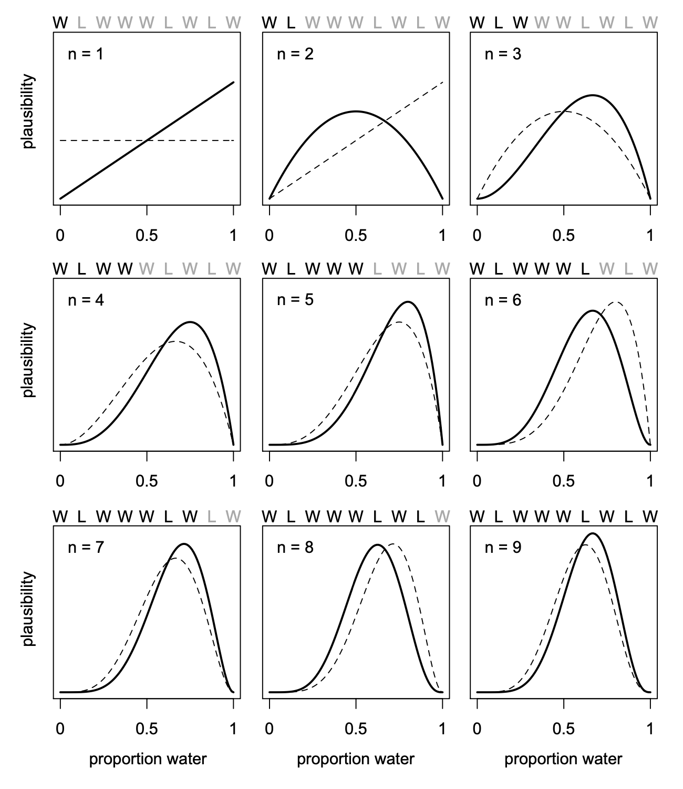

```{r xaringan-themer, include = FALSE}
library(xaringanthemer)
mono_light(
  base_color = "#23395b",
  header_font_google = google_font("Josefin Sans"),
  text_font_google   = google_font("Montserrat", "300", "300i"),
  code_font_google   = google_font("Droid Mono"),
)

library(tidyverse)
library(broom)
```

<style type="text/css">
.remark-slide-content {
    font-size: 30px;
    padding: 1em 4em 1em 4em;
}

.small .remark-code { 
  font-size: 80% !important;
}
.tiny .remark-code {
  font-size: 65% !important;
}
</style>


## Goals for the week

Probability, counting, and learning via Bayes

---
## Goals for the semester

1. Take what you know (regression) and do it Bayesian (and more!)
2. Know the advantages of Bayesian data analysis
3. Rethink your approach to statistical inference

---
## "Frequentist" analysis

$$ Y_i = \beta_0 + \beta_1 X + \epsilon_i     $$

- OLS, sampling distributions around zero, p-values, large samples so as to invoke CLT


---
## Why Bayes? 
1. Intuitive concept of probability 
2. Estimation flexibility (did you care about OLS -> ML?)
3. More explicit in terms of assumptions
4. Generative model building ie represents a random process that could generate a new dataset
5. Better for small samples/lots of parameters
6. Better at making predictions for novel events
7. Some tasks are simpler in Bayesian Frameworks (regularization, error-corrections, contrasts, robust analysis, calculating error bars/bands)  
...  
8. Incorporate prior intuitions

---
## What is Bayes?


---
## A working mental model

What is Bayesian regression? 
1. "Normal" regression with a different algorithm. 
2. Priors that differ from "regular" regression, which are uniform
3. Results that represent a distribution rather than a point estimate and some uncertainty. 


---
##  "Normal" regression with a different algorithm. 

You typically use OLS to get estimates of beta. Maybe WLS or maximum likelihood. With bayes we will use counting. 

Counting for simple tasks is easy but it doesn't scale well. For complex tasks we will "guess" at our counts, much in the same way that maximum likelihood does (ie it isn't analytic). But the logic of counting is the same. 

---
## "Bayesian analysis is just counting"

- Counting is just a simplified way of understanding probability, which is central to all stats. 

- What is the proportion of blue (vs white) marbles in a bag? The proportion of blue marbles can be thought of as a parameter we want to estimate, much like we want to estimate beta. 

- If there are only four marbles in the bag there are 5 possible combinations of marbles. So my parameter can take 5 different values. We can collect some data and ask: How likely are each my possible parameters? 

---
## What are our possibilities?

```{r, echo = FALSE}
library(tidyverse)
d <-
  tibble(p_1 = 0,
         p_2 = rep(1:0, times = c(1, 3)),
         p_3 = rep(1:0, times = c(2, 2)),
         p_4 = rep(1:0, times = c(3, 1)),
         p_5 = 1)
d %>% 
  gather() %>% 
  mutate(x = rep(1:4, times = 5),
         possibility = rep(1:5, each = 4)) %>% 
  ggplot(aes(x = x, y = possibility, 
             fill = value %>% as.character())) +
  geom_point(shape = 21, size = 5) +
  scale_fill_manual(values = c("white", "navy")) +
  scale_x_continuous(NULL, breaks = NULL) +
  coord_cartesian(xlim = c(.75, 4.25),
                  ylim = c(.75, 5.25)) +
  theme(legend.position = "none")

```

---
### Bayesian analysis is just counting
Marbles^draws = number of possibilities. 1 data point, there are 4 options. 2: 16;  3: 64. 

We then go out and collect data. Say Blue, White, Blue. If you got this, what would you say about your parameter estimate, ie how many blues are in the bag? 2/4? 3/4? 1/4?

The way a Bayesian counts is they to count ALL ways that the data *could* happen. To assist with this we can make a conjecture or a guess about the world. Based on the previous graph, we can see that we could only have blue white blue for 3/5 possibilities. 

Assuming that the true bag contains only 1 blue (1/4 blue), how likely is it to give us Blue, White, Blue?

---
## Bayesian analysis is just counting

.pull-left[
.small[
```{r, echo = FALSE}
d <-
  tibble(position = c((1:4^1) / 4^0, 
                      (1:4^2) / 4^1, 
                      (1:4^3) / 4^2),
         draw     = rep(1:3, times = c(4^1, 4^2, 4^3)),
         fill     = rep(c("b", "w"), times = c(1, 3)) %>% 
           rep(., times = c(4^0 + 4^1 + 4^2)))

d <-
  d %>% 
  mutate(denominator = ifelse(draw == 1, .5,
                              ifelse(draw == 2, .5 / 4,
                                     .5 / 4^2))) %>% 
  mutate(position    = position - denominator)

lines_1 <-
  tibble(x    = rep((1:4), each = 4),
         xend = ((1:4^2) / 4),
         y    = 1,
         yend = 2)
  lines_1 <-
  lines_1 %>% 
  mutate(x    = x - .5,
         xend = xend - .5 / 4^1)
  
  lines_2 <-
  tibble(x    = rep(((1:4^2) / 4), each = 4),
         xend = (1:4^3) / (4^2),
         y    = 2,
         yend = 3)
    lines_2 <-
  lines_2 %>% 
  mutate(x    = x - .5 / 4^1,
         xend = xend - .5 / 4^2)
  
d %>% 
  ggplot(aes(x = position, y = draw)) +
  geom_segment(data  = lines_1,
               aes(x = x, xend = xend,
                   y = y, yend = yend),
               size  = 1/3) +
  geom_segment(data  = lines_2,
               aes(x = x, xend = xend,
                   y = y, yend = yend),
               size  = 1/3) +
  geom_point(aes(fill = fill),
             shape = 21, size = 3) +
    scale_x_continuous(NULL, limits = c(0, 4), breaks = NULL) +
  scale_y_continuous(NULL, limits = c(0.75, 3), breaks = NULL) +
  scale_fill_manual(values  = c("navy", "white")) +
  theme(panel.grid.minor = element_blank(),
        legend.position  = "none")
```
]]

.pull-right[
These are the 64 ways that could come out of a 1 blue bag (number of marbles ^ number of draws). We make assumptions (1 blue in a bag) and then probability gives us  a way to count them.   

How many of these give us our Blue, White, Blue? 

]

--- 
## Bayesian analysis is just counting
.pull-left[
.small[
```{r, echo = FALSE}
lines_1 <-
  lines_1 %>% 
  mutate(remain = c(rep(0:1, times = c(1, 3)),
                    rep(0,   times = 4 * 3)))

lines_2 <-
  lines_2 %>% 
  mutate(remain = c(rep(0,   times = 4),
                    rep(1:0, times = c(1, 3)) %>% 
                      rep(., times = 3),
                    rep(0,   times = 12 * 4)))

d <-
  d %>% 
  mutate(remain = c(rep(1:0, times = c(1, 3)),
                    rep(0:1, times = c(1, 3)),
                    rep(0,   times = 4 * 4),
                    rep(1:0, times = c(1, 3)) %>% 
                      rep(., times = 3),
                    rep(0,   times = 12 * 4))) 

d %>% 
  ggplot(aes(x = position, y = draw)) +
  geom_segment(data  = lines_1,
               aes(x = x, xend = xend,
                   y = y, yend = yend,
                   alpha = remain %>% as.character()),
               size  = 1/3) +
  geom_segment(data  = lines_2,
               aes(x = x, xend = xend,
                   y = y, yend = yend,
                   alpha = remain %>% as.character()),
               size  = 1/3) +
  geom_point(aes(fill = fill, alpha = remain %>% as.character()),
             shape = 21, size = 4) +
  # it's the alpha parameter that makes elements semitransparent
  scale_alpha_manual(values = c(1/10, 1)) +
  scale_fill_manual(values  = c("navy", "white")) +
  scale_x_continuous(NULL, limits = c(0, 4), breaks = NULL) +
  scale_y_continuous(NULL, limits = c(0.75, 3), breaks = NULL) +
  theme(panel.grid      = element_blank(),
        legend.position = "none")
```
]]

.pull-right[
We see that 3 pathways could give us our data. Is that good, bad? what do we compare it to? 
]

---
## Bayesian analysis is just counting

.pull-left[ We need to compare to other possible states of the world. Namely, what if it was 1/2 blue or 3/4 blue? (0 and all blue are not possible based on our data) ]

.pull-right[
```{r, echo = FALSE}
d <-
  tibble(position = c((1:4^1) / 4^0, 
                      (1:4^2) / 4^1, 
                      (1:4^3) / 4^2),
         draw     = rep(1:3, times = c(4^1, 4^2, 4^3)))


  d <-
  d %>% 
  bind_rows(
    d, d
  ) %>% 
  # here are the fill colors
  mutate(fill = c(rep(c("w", "b"), times = c(1, 3)) %>% rep(., times = c(4^0 + 4^1 + 4^2)),
                  rep(c("w", "b"), each  = 2)       %>% rep(., times = c(4^0 + 4^1 + 4^2)),
                  rep(c("w", "b"), times = c(3, 1)) %>% rep(., times = c(4^0 + 4^1 + 4^2)))) %>% 
  # now we need to shift the positions over in accordance with draw, like before
  mutate(denominator = ifelse(draw == 1, .5,
                              ifelse(draw == 2, .5 / 4,
                                     .5 / 4^2))) %>% 
  mutate(position = position - denominator) %>% 
  # here we'll add an index for which pie wedge we're working with
  mutate(pie_index = rep(letters[1:3], each = n()/3)) %>% 
  # to get the position axis correct for pie_index == "b" or "c", we'll need to offset
  mutate(position = ifelse(pie_index == "a", position,
                           ifelse(pie_index == "b", position + 4,
                                  position + 4 * 2)))
 
   move_over <- function(position, index){
  ifelse(index == "a", position,
         ifelse(index == "b", position + 4,
                position + 4 * 2)
         )
  }
  
   lines_1 <-
  tibble(x    = rep((1:4), each = 4) %>% rep(., times = 3),
         xend = ((1:4^2) / 4)        %>% rep(., times = 3),
         y    = 1,
         yend = 2) %>% 
  mutate(x    = x - .5,
         xend = xend - .5 / 4^1) %>% 
  # here we'll add an index for which pie wedge we're working with
  mutate(pie_index = rep(letters[1:3], each = n()/3)) %>% 
  # to get the position axis correct for `pie_index == "b"` or `"c"`, we'll need to offset
  mutate(x    = move_over(position = x,    index = pie_index),
         xend = move_over(position = xend, index = pie_index))
   
   lines_2 <-
  tibble(x    = rep(((1:4^2) / 4), each = 4)  %>% rep(., times = 3),
         xend = (1:4^3 / 4^2)                 %>% rep(., times = 3),
         y    = 2,
         yend = 3) %>% 
  mutate(x    = x - .5 / 4^1,
         xend = xend - .5 / 4^2) %>% 
  # here we'll add an index for which pie wedge we're working with
  mutate(pie_index = rep(letters[1:3], each = n()/3)) %>% 
  # to get the position axis correct for `pie_index == "b"` or `"c"`, we'll need to offset
  mutate(x    = move_over(position = x,    index = pie_index),
         xend = move_over(position = xend, index = pie_index))
   
   d <- 
  d %>% 
  mutate(remain = c(# `pie_index == "a"`
                    rep(0:1, times = c(1, 3)),
                    rep(0,   times = 4),
                    rep(1:0, times = c(1, 3)) %>% 
                      rep(., times = 3),
                    rep(0,   times = 4 * 4),
                    rep(c(0, 1, 0), times = c(1, 3, 4 * 3)) %>% 
                      rep(., times = 3),
                    # `pie_index == "b"`
                    rep(0:1, each = 2),
                    rep(0,   times = 4 * 2),
                    rep(1:0, each = 2) %>% 
                      rep(., times = 2),
                    rep(0,   times = 4 * 4 * 2),
                    rep(c(0, 1, 0, 1, 0), times = c(2, 2, 2, 2, 8)) %>% 
                      rep(., times = 2),
                    # `pie_index == "c"`
                    rep(0:1, times = c(3, 1)),
                    rep(0,   times = 4 * 3),
                    rep(1:0, times = c(3, 1)), 
                    rep(0,   times = 4 * 4 * 3),
                    rep(0:1, times = c(3, 1)) %>% 
                      rep(., times = 3),
                    rep(0,   times = 4)
                    )
         )

lines_1 <-
  lines_1 %>% 
  mutate(remain = c(rep(0,   times = 4),
                    rep(1:0, times = c(1, 3)) %>% 
                      rep(., times = 3),
                    rep(0,   times = 4 * 2),
                    rep(1:0, each  = 2) %>% 
                      rep(., times = 2),
                    rep(0,   times = 4 * 3),
                    rep(1:0, times = c(3, 1))
                    )
         )

lines_2 <-
  lines_2 %>% 
  mutate(remain = c(rep(0,   times = 4 * 4),
                    rep(c(0, 1, 0), times = c(1, 3, 4 * 3)) %>% 
                      rep(., times = 3),
                    rep(0,   times = 4 * 8),
                    rep(c(0, 1, 0, 1, 0), times = c(2, 2, 2, 2, 8)) %>% 
                      rep(., times = 2),
                    rep(0,   times = 4 * 4 * 3),
                    rep(0:1, times = c(3, 1)) %>% 
                      rep(., times = 3),
                    rep(0,   times = 4)
                    )
         )

d %>% 
  ggplot(aes(x = position, y = draw)) +
  geom_vline(xintercept = c(0, 4, 8), color = "white", size = 2/3) +
  geom_segment(data  = lines_1,
               aes(x = x, xend = xend,
                   y = y, yend = yend,
                   alpha = remain %>% as.character()),
               size  = 1/3) +
  geom_segment(data  = lines_2,
               aes(x = x, xend = xend,
                   y = y, yend = yend,
                   alpha = remain %>% as.character()),
               size  = 1/3) +
  geom_point(aes(fill = fill, size = draw, alpha = remain %>% as.character()),
             shape = 21) +
  scale_size_continuous(range = c(3, 1.5)) +
  scale_alpha_manual(values = c(1/10, 1)) +
  scale_fill_manual(values  = c("navy", "white")) +
  scale_x_continuous(NULL, limits = c(0, 12),     breaks = NULL) +
  scale_y_continuous(NULL, limits = c(0.75, 3.5), breaks = NULL) +
  theme(panel.grid      = element_blank(),
        legend.position = "none") +
  coord_polar()
```
]

---
## Bayesian analysis is just counting
There are 3, 9 and 8 ways. This is all the ways the marbles could appear based on our assumptions about the model. 

So what can we do with this? Looks like the bag as 3 or 2 blue marbles, but it is close. It still could be 1 blue marble. Not completely unthinkable. What about if we collected more data? 

---
### Collecting more data
Collect 1 more blue (bwbb). Counting is just multiplication. 

```{r, echo = FALSE}
n_blue <- function(x){
  rowSums(x == "b")
}

n_white <- function(x){
  rowSums(x == "w")
}

t <-
  # for the first four columns, `p_` indexes position
  tibble(d_1 = rep(c("w", "b"), times = c(1, 4)),
         d_2 = rep(c("w", "b"), times = c(2, 3)),
         d_3 = rep(c("w", "b"), times = c(3, 2)),
         d_4 = rep(c("w", "b"), times = c(4, 1))) %>% 
  mutate(`draw 1: blue`  = n_blue(.),
         `draw 2: white` = n_white(.),
         `draw 3: blue`  = n_blue(.)) %>% 
  mutate(`ways to produce` = `draw 1: blue` * `draw 2: white` * `draw 3: blue`)

t <-
  t %>% 
  rename(`previous counts` = `ways to produce`,
         `ways to produce` = `draw 1: blue`) %>% 
  select(d_1:d_4, `ways to produce`, `previous counts`) %>% 
  mutate(`new count` = `ways to produce` * `previous counts`)

t %>% 
  knitr::kable(format = "html")
```

Ways to produce is how many different blue marbles we could pull. New counts serve as our new data, created through multiplication.

---
### Counts as probabilities
"We don't know what caused the data, potential causes that may produce the data in more ways are more plausible/credible."

Counts are difficult to work with because once you collect more data you get more possibilities. "Plausibilities" or "credibilities" can be defined as taking the number of ways p can produce the data divided by the sum of the products so the plausibility adds up to 1.

```{r, echo = FALSE}
t %>% 
  select(d_1:d_4) %>% 
  mutate(p                      = seq(from = 0, to = 1, by = .25),
         `ways to produce data` = c(0, 3, 16, 27, 0)) %>% 
  mutate(plausibility           = `ways to produce data` / sum(`ways to produce data`))
```

---
## Bayesian analysis is just counting

The p here is a `parameter` that we want to estimate. Similar to regression equation bs. Note we are interested in plausibility of all parameters, not to estimate a single best one. 

The `likelihood` is the relative number of ways to produce the data 

The `posterior probability` is the credibilities/plausibility 

---
## you've seen this before
.pull-left[
data = bwbb. 3 blues out of 4 trials. 

```{r, eval=FALSE}
p <- seq(0.01, 0.99, by = 0.01)
loglike <- dbinom(3, size = 4, prob = p)
plot(loglike)

```
]

.pull-right[
```{r, echo = FALSE}
p <- seq(0.01, 0.99, by = 0.01)
loglike <- dbinom(3, size = 4, prob = p)
plot(loglike)

```
]

---
## Bayesian analysis is just counting

- Bayesian analysis counts all ways that something can happen (according to assumptions/model). Assumptions with more ways that are consistent with data are more plausible. 

- This method is not demonstrably different than standard approaches. Standard likelihood approaches uses the values that are most consistent with the data. An explain it me like I'm five way for ML is to try out all possible numbers and tell you which ones are most likely.  

- Where Bayes differs, is 1) we will focus beyond just a "best estimate" and 2) we will incorporate prior intuition. 

---
## A working mental model

What is Bayesian regression? 
1. "Normal" regression with a different algorithm. 
2. Priors that differ from "regular" regression, which are uniform
3. Results that represent a distribution rather than a point estimate and some uncertainty. 

---
##  Are frequentists more objective? 

What prior information is incorporated into frequentist regression?
None. 

But what do we mean by that? Graphically, this is a uniform distribution where all values are equally likely. 

---
## Priors
Priors are a way to incorporate your beliefs into the model. Priors will be discussed in the form of a probability distribution. 

Think about this as initial possibilities in a murder mystery. The prior is another way of saying how likely someone is for the murder prior to collecting any clues (data). When we start collecting data these clues are interpreted through our original intuitions (priors). If I find that the murder weapon is a candlestick, I'll look more closely at the candlestick maker and less at the baker who has an irrational fear of candlesticks. 

---
### "Bayesian inference is reallocation of plausibility"

How often do we have these prior intuitions or data? Often!!  

Above we assumed all parameter values, p, were equally likely. But we have previous information all the time in terms of plausible effect sizes and previous research. 

Some possible prior  `distributions`

---
```{r, echo = FALSE}
a <- ggplot(data = data.frame(x = c(-3, 3)), aes(x)) +
  stat_function(fun = dnorm, n = 101, args = list(mean = 0, sd = 1)) + ylab("") + scale_y_continuous(breaks = NULL)

b<- ggplot(data = data.frame(x = c(-10, 10)), aes(x)) +
  stat_function(fun = dnorm, n = 101, args = list(mean = 0, sd = 3)) + ylab("")  +scale_y_continuous(breaks = NULL)
  
library(patchwork)
a/b
```

---
### Frequentist prior

```{r, echo=FALSE}
ggplot(data = data.frame(x = c(-50000.1, 50000.1)), aes(x)) +
   stat_function(fun = dunif, args = list(min = -50000, max = 50000)) + ylab("")  +scale_y_continuous(breaks = NULL)
```

---
## Bayesian inference is reallocation of plausibility 

.pull-left[
These prior distributions are then going to be incorporated with data to give us a posterior distribution (aka results). What does a posterior distribution (results) look like? 

]

.pull-right[

```{r, echo = FALSE}
ggplot(data = data.frame(x = c(-2, 6)), aes(x)) +
  stat_function(fun = dnorm, n = 101, args = list(mean = 2, sd = 1)) + ylab("") + scale_y_continuous(breaks = NULL)

```
]

---
## A working mental model summary

What is Bayesian regression? 
1. "Normal" regression with a different algorithm. 
2. Priors that incorporate information via a distribution 
3. Results that represent a distribution rather than a point estimate and some uncertainty. 


---
## Distributions and model descriptions
Because we are going to be working with a lot of distributions, priors, and different analytic machinery we need to have a new way to describe out models. Much like y = b0 + b1X but more elaborate.  

1. Describe how our DV is related to the data via a likelihood distribution. 

DV ~ Normal( $\mu_i$ , $\sigma$)

Here we say that our DGP is normal, with two parameters. The mean differs among i people. The first step will always be describing how DGP for our DV.  

---
Many possibilities
$$ y_{i} \sim \operatorname{Bernoulli}(\theta_i) $$

$$ y_{i} \sim \operatorname{Binomial}(1, p_i) $$
$$ y_i \sim \text{Poisson}(\lambda_i) $$

$$ y_i  \sim \operatorname{BetaBinomial}(n_i, \bar p_i, \phi) $$
$$ y_i  \sim \operatorname{ZIPoisson}({p_i}, {\lambda_i})\\
 $$
$$ y_i \sim \operatorname{Categorical} (\mathbf p) \\ $$ where P is a vector of probabilities (this is for ordered logits like in IRT or when you have likert rating scales as your IV)


---
## Design the model

.pull-left[
2. We can predict or decompose those parameters through other variables. For example, we want to understand why i people differ on the mean of the DV.  

DV ~ Normal( $\mu_i$ , $\sigma$ )  

$\mu_i$ = $\beta$ X $X_i$
]

.pull-right[
At this point, no different that a normal regression you are familiar with, just a different way of writing it. 

You also have a parameter that is estimated called sigma, which in R output is hidden under Residual Standard Error. This way is more explicit about 1. your data generating process and 2. what parameters you are modeling. 
]

---
## Design the model

.pull-left[
3. We will use this same nomenclature to describe our priors on each of the parameters we are modeling. For example, we are estimating $\beta$ and $\sigma$, and thus we need two priors. 
]

.pull-right[
DV ~ Normal( $\mu_i$ , $\sigma$ )  
$\mu_i$ = $\beta$ X $X_i$

$\beta$ ~ Normal(0, 5)  
$\sigma$ ~ HalfCauchy(0,1)
]

---
## 3 components of bayesian regression models
1. priors
2. likelihood
3. posterior

---
## Priors
.pull-left[
In the above example, we have a prior of $\beta$ ~ Normal(0, 5), which provides us a general idea about what we would expect the regression to be BEFORE WE COLLECTED DATA. 
]

.pull-right[
```{r, echo = FALSE}

N10 <- ggplot(data.frame(x = c(-35, 35)), aes(x)) +
  stat_function(fun = dnorm, n = 100, args = list(0, 10))+
  labs(title = "B ~ Normal(0, 10)")

N5 <- ggplot(data.frame(x = c(-35, 35)), aes(x)) +
  stat_function(fun = dnorm, n = 100, args = list(0, 5)) +
  labs(title = "B ~ Normal(0, 5)")

N1 <- ggplot(data.frame(x = c(-35, 35)), aes(x)) +
  stat_function(fun = dnorm, n = 100, args = list(0, 1)) +
  labs(title = " B ~ Normal(0, 1)")

N2 <- ggplot(data.frame(x = c(-35, 35)), aes(x)) +
  stat_function(fun = dnorm, n = 100, args = list(0, 2)) +
  labs(title = "B ~ Normal(0, 2)")
library(patchwork)
(N10 | N5 )/
  (N1 | N2 )
```
]

---
## Priors
```{r, echo = FALSE}
s1 <- ggplot(data.frame(x = c(0, 10)), aes(x)) +
  stat_function(fun = dcauchy, n = 200, args = list(0, 1)) +  labs(title = "sigma ~ HalfCauchy(0,1)")

s10 <- ggplot(data.frame(x = c(0, 10)), aes(x)) +
  stat_function(fun = dcauchy, n = 200, args = list(0, 10)) +
  labs(title = "sigma ~ HalfCauchy(0,10)")

(s1 + s10)
```

---
###  Thinking in probability distributions
 
Gaussian/normal (mean and SD, also known as location and scale). Binomial (Beta-binomial), Bernouli. Student too. 

Negative binomial, Poisson and geometric for counts

Exponential, lognormal, gamma, weibull for survival models

LKJ for correlations

Cumulative for categorical

Exgaussian, weiner for response time. 

---
## Priors
We will often choose priors that are called `regularizing` or `weakly informative`. The purpose of these priors is to make sure that we are not over fitting our models. We want to be both conservative as well as put in prior feelings of the model. 

This approach can be contrasted with a view that makes "guesses" about the effects rather than a weakly informative prior. We will encounter some uses for this later in the semester, but at the moment this type of prior is not considered as cooth as the regularizing/weakly informative priors. 

When we have enough data the prior will be inconsequential. So we wont worry about specifics until later in the semester

---
## Likelihood
We will use the likelihood along with the prior to get our posterior. This formula is exactly what we did in our counting example above. 

$$p(\theta | data) \propto \frac{p(data | \theta) \times p(\theta )}{p(data)}$$
P(θ|data) is the posterior probability. 

P(θ) is the prior probability, which describes how sure we were that theta was true, before we observed the data.

The likelihood of $\theta$ = p(data| $\theta$ ).  


---

Mathematical function (often) to identify the probability of different parameters. Technically it is the distribution of the likelihood of various hypothesis. p(data | $\theta$ )

You've seen this before! Maximum likelihood estimation for frequentist SEM or MLM is the same. 

Above we specified how we are going to compute the likelihood via: 
DV ~ Normal( $\mu_i$ , $\sigma$ )

---
## Likelihood

.pull-left[
Binomial distribution. Given number of trials (N) and the probability of being correct (p), you could calculate the probability of different number of successes (k).

$$p(k|N,p) =   {{N}\choose{k}} \cdot p^kq^{N-k}$$
]

.pull-right[
After we collect some data, we can figure out the probability of getting 3 successes out of 10 trials, assuming a probability of .5. 
```{r}
dbinom(3, size = 10, prob = .5)
```
]

---
## Likelihood
.pull-left[
In intro stats you used this to asked whether a coin appeared fair. Also calculated the probability of getting 3 or less, as more extreme is what we were interested in. 

```{r}
pbinom(3, size = 10, prob = .5)
```
]

.pull-right[
But what we typically want when figuring out a parameter is not one specific parameter (ie is the fair or not) but what is the MOST likely parameter -- AND what is the probability of each possibility parameter. That is what the likelihood tells us. L( $\theta$ ) = p(data| $\theta$ ) The probability of the data that you actually got, assuming a particular theta is true.
]

---
.pull-left[
```{r, eval = FALSE}
ggplot(tibble(x = c(0, 1)),  aes(x = x)) + 
  stat_function(fun = dbinom, args = list(x = 3, size = 10)) + labs(x = expression(theta), 
       y = "likelihood")
```

The likelihood of $\theta$ = p(data| $\theta$ ).
For conditional probabilities, theta (your hypothesis) is treated as a given, and the data are free to vary. For likelihood, the data are treated as a given, and value of theta varies.
]

.pull-right[
 

```{r, echo = FALSE}

ggplot(tibble(x = c(0, 1)), 
       aes(x = x)) + 
  stat_function(fun = dbinom, args = list(x = 3, size = 10)) + 
  labs(x = expression(theta), 
       y = "likelihood")
```

]

---
### Maximum Likelihood estimation
Maximum likelihood is similar to  the above binomial example where there is a p(data| $\theta$ ). However, in frequentist theta does not vary, it is fixed. 

But what is typically reported with ML? A mean estimate and an estimate of standard error, not a distribution. Moreover, there is an assumed normal distribution of these likelihoods. This is why robust ML is a thing. 

When the prior is flat, our likelihood ends up becoming the posterior distribution and thus is going to be equivalent to the ML estimate. 

---
## Posterior
The `posterior distribution` is the distribution of our belief about the parameter values after taking into account the data and one's priors. p( $\theta$ |data). 

In terms of our murder mystery example, it is an updated prior distribution. That is, the only difference between the prior and the posterior is that you collected data. If you collect data and have a posterior and then want to collect more data, your posterior can then become the prior. Repeat this process an infinite number of possible times. This process is called `Bayesian Updating`.


---

```{r echo=FALSE, out.height=550, out.width= 850}

```


---
## Posterior
.pull-left[


$$p(\theta | data) \propto \frac{p(data | \theta) \times p(\theta )}{p(data)}$$
P(θ|data) is the posterior probability. It describes how confident we are that hypothesis H is true, given the observed data. 

 P(θ) is the prior probability, which describes how sure we were that theta was true, before we observed the data.
 
 ]

.pull-right[


P(data|θ) is the likelihood. If you were to assume that theta is true, this is the probability that you would have observed data.

P(data) is the average or marginal likelihood, sometimes called "the evidence". The main purpose of this is to standardize the posterior so it integrates to 1. 
]

---
## Priors influencing Posterior


```{r, message = FALSE, echo = FALSE}
library(gridExtra)
library(tidyverse)
sequence_length <- 1e3

d <-
  tibble(probability = seq(from = 0, to = 1, length.out = sequence_length)) %>% 
  tidyr::expand(probability, row = c("flat", "stepped", "Laplace")) %>% 
  arrange(row, probability) %>% 
  mutate(prior = ifelse(row == "flat", 1,
                        ifelse(row == "stepped", rep(0:1, each = sequence_length / 2),
                               exp(-abs(probability - .5) / .25) / ( 2 * .25))),
         likelihood = dbinom(x = 6, size = 9, prob = probability)) %>% 
  group_by(row) %>% 
  mutate(posterior = prior * likelihood / sum(prior * likelihood)) %>% 
  gather(key, value, -probability, -row) %>% 
  ungroup() %>% 
  mutate(key = factor(key, levels = c("prior", "likelihood", "posterior")),
         row = factor(row, levels = c("flat", "stepped", "Laplace"))) 

p1 <-
  d %>%
  filter(key == "prior") %>% 
  ggplot(aes(x = probability, y = value)) +
  geom_line() +
  scale_x_continuous(NULL, breaks = c(0, .5, 1)) +
  scale_y_continuous(NULL, breaks = NULL) +
  labs(subtitle = "prior") +
  theme(panel.grid       = element_blank(),
        strip.background = element_blank(),
        strip.text       = element_blank()) +
  facet_wrap(row ~ ., scales = "free_y", ncol = 1)

p2 <-
  d %>%
  filter(key == "likelihood") %>% 
  ggplot(aes(x = probability, y = value)) +
  geom_line() +
  scale_x_continuous(NULL, breaks = c(0, .5, 1)) +
  scale_y_continuous(NULL, breaks = NULL) +
  labs(subtitle = "likelihood") +
  theme(panel.grid       = element_blank(),
        strip.background = element_blank(),
        strip.text       = element_blank()) +
  facet_wrap(row ~ ., scales = "free_y", ncol = 1)

p3 <-
  d %>%
  filter(key == "posterior") %>% 
  ggplot(aes(x = probability, y = value)) +
  geom_line() +
  scale_x_continuous(NULL, breaks = c(0, .5, 1)) +
  scale_y_continuous(NULL, breaks = NULL) +
  labs(subtitle = "posterior") +
  theme(panel.grid       = element_blank(),
        strip.background = element_blank(),
        strip.text       = element_blank()) +
  facet_wrap(row ~ ., scales = "free_y", ncol = 1)

library(gridExtra)

grid.arrange(p1, p2, p3, ncol = 3)
```

---
### Building intuition
 
1. The probability of any parameter in the posterior is found by counting, but the counting depends on the prior (previous counts or information) as well as new data collected. 

2. If your prior says an option is impossible (Eg below .5, second row) your posterior will incorporate that information, just as if you were a detective and you already ruled out a suspect.  

3. When the prior is uniform (ie flat) the likelihood is equivalent to the posterior. 

---
## Sample size influences

.pull-left[
The relative influence of the prior and the likelihood depends on 1) the sample size of the data collected and 2) the extremity of the prior (think peaked vs very flat)

]

.pull-right[
```{r, echo = FALSE}

bernoulli_likelihood <- function(theta, data) {
  # `theta` = success probability parameter ranging from 0 to 1
  # `data` = the vector of data (i.e., a series of 0s and 1s)
  n   <- length(data)
  return(theta^sum(data) * (1 - theta)^(n - sum(data)))
}
  
small_data <- rep(0:1, times = c(3, 1))

s <- tibble(theta =   seq(from = 0,     to = 1, by = .001),
       Prior = c(seq(from = 0,     to = 1, length.out = 501),
                 seq(from = 0.998, to = 0, length.out = 500))) %>% 
  mutate(Prior      = Prior / sum(Prior),
         Likelihood = bernoulli_likelihood(theta = theta,
                                           data  = small_data)) %>% 
  mutate(marginal_likelihood = sum(Prior * Likelihood)) %>% 
  mutate(Posterior           = (Prior * Likelihood) / marginal_likelihood) %>% 
  select(theta, Prior, Likelihood, Posterior) %>% 
  gather(key, value, -theta) %>% 
  mutate(key = factor(key, levels = c("Prior", "Likelihood", "Posterior")))  

small <- ggplot(s, aes(x = theta, ymin = 0, ymax = value)) +
  geom_ribbon(fill = "grey67") +
  scale_x_continuous(breaks = seq(from = 0, to = 1, by = .2)) +
  labs(x = expression(theta),
       y = "probability density") +
  theme(panel.grid = element_blank()) +
  facet_wrap(~key, scales = "free_y", ncol = 1)


large_data <- rep(0:1, times = c(30, 10))

l <- tibble(theta =   seq(from = 0,     to = 1, by = .001),
       Prior = c(seq(from = 0,     to = 1, length.out = 501),
                 seq(from = 0.998, to = 0, length.out = 500))) %>% 
  mutate(Prior      = Prior / sum(Prior),
         Likelihood = bernoulli_likelihood(theta = theta,
                                           data  = large_data)) %>% 
  mutate(marginal_likelihood = sum(Prior * Likelihood)) %>% 
  mutate(Posterior           = (Prior * Likelihood) / marginal_likelihood) %>% 
  select(theta, Prior, Likelihood, Posterior) %>% 
  gather(key, value, -theta) %>% 
  mutate(key = factor(key, levels = c("Prior", "Likelihood", "Posterior"))) 
  
 large <- ggplot(l, aes(x = theta, ymin = 0, ymax = value)) +
  geom_ribbon(fill = "grey67") +
  scale_x_continuous(breaks = seq(from = 0, to = 1, by = .2)) +
  labs(x = expression(theta),
       y = "probability density") +
  theme(panel.grid = element_blank()) +
  facet_wrap(~key, scales = "free_y", ncol = 1)

(small | large)
```
]

---
### Posterior = sampling distribution? 
This is right and wrong. It is wrong in the sense that a sampling distribution is "in the long run". With Bayesian, this is the logical result of inputs (along with choice of likelihood and estimation). 

The similarity is that with more data you have more accurate inferences, in so much as the precision of your inference is closer. With larger sample size (all else being the same) you have a skinnier posterior distribution. 

---
## Grid Estimation

.pull-left[
How do we "turn the Bayesian crank" and find the posterior?

1. Define the grid you want to estimate. a) the range of parameters you want and b) the number of values. Remember, Bayesian analysis counts all ways that something can happen (according to assumptions/model -- 1 blue vs 2 blues in the bag). Assumptions with more ways that are consistent with data are more plausible. 
 

]

.pull-right[

```{r, eval = FALSE}
library(tidyverse)
grid <-tibble(p_grid= seq(from = 0, to = 1, length.out = 20), prior = 1) 
grid
```

```{r, echo = FALSE}
library(tidyverse)
grid <-tibble(p_grid= seq(from = 0, to = 1, length.out = 20), prior = 1) 
grid
```
]

---
## Grid Estimation
.pull-left[

2. Define the prior. Lets use 1 (everything is equal) to begin

'3. Compute the likelihood at each parameter value you want to estimate. 

```{r, eval = FALSE}
grid <- grid %>% 
 mutate(likelihood  = dbinom(6, size = 9, prob = p_grid)) 
```
]

.pull-right[
```{r, echo = FALSE}
grid <- grid %>% 
 mutate(likelihood  = dbinom(6, size = 9, prob = p_grid)) 
grid
```

]

---
## Grid Estimation
.pull-left[
'4. Now that we have the likelihood, we can multiply it by the prior to get the unstandardized posterior
```{r, eval = FALSE}
grid <- grid %>% 
mutate(unstd_posterior = likelihood * prior) 

grid
```
]

.pull-right[
```{r, echo = FALSE}
grid <- grid %>% 
mutate(unstd_posterior = likelihood * prior) 
grid
```
]

---
## Grid Estimation
.pull-left[
'5. we standardized the posterior by dividing by sum of all values. 
```{r, eval = FALSE}
grid <- grid %>% 
mutate(posterior = unstd_posterior / sum(unstd_posterior))
```

Now it sums up to 1
]

.pull-right[
```{r, echo = FALSE}
grid <- grid %>% 
mutate(posterior = unstd_posterior / sum(unstd_posterior)) 

grid2 <- grid %>% 
  select(unstd_posterior, posterior)
grid2
```
]

---
## Grid Estimation
```{r, echo = FALSE}

g20 <- ggplot(grid, aes(x = p_grid, y = posterior)) +
  geom_point() +
  geom_line() +
  labs(subtitle = "20 points",
       x = "theta",
       y = "posterior probability") +
  theme(panel.grid = element_blank())
g20
```

---
### smaller grid
```{r, echo = FALSE}
tibble(p_grid            = seq(from = 0, to = 1, length.out = 5),
       prior             = 1) %>%
  mutate(likelihood      = dbinom(6, size = 9, prob = p_grid)) %>%
  mutate(unstd_posterior = likelihood * prior) %>%
  mutate(posterior       = unstd_posterior / sum(unstd_posterior)) %>% 
  
  ggplot(aes(x = p_grid, y = posterior)) +
  geom_point() +
  geom_line() +
  labs(subtitle = "5 points",
       x = "theta",
       y = "posterior probability") +
  theme(panel.grid = element_blank())
```

---
### add a (peaked) prior

.pull-left[
```{r, eval = FALSE}
peaked <- tibble(p_grid = seq(from = 0, to = 1, length.out = 20),
       prior = c(seq(from = 0, to = 1, length.out = 10), seq(from = 0.998, to = 0, length.out = 10)))

```
]

.pull-right[
```{r, echo=FALSE}
peaked <- tibble(p_grid = seq(from = 0, to = 1, length.out = 20),
       prior = c(seq(from = 0, to = 1, length.out = 10), seq(from = 0.998, to = 0, length.out = 10)))

peaked
```
]

---
### add a (peaked) prior
```{r, echo = FALSE}

peaked <- peaked %>% 
  mutate(likelihood = dbinom(6, size = 9, prob = p_grid)) %>%
  mutate(unstd_posterior = likelihood * prior) %>%
  mutate(posterior= unstd_posterior / sum(unstd_posterior)) 
  
g.peaked  <- ggplot(peaked, aes(x = p_grid, y = posterior)) +
  geom_point() +
  geom_line() +
  labs(subtitle = "peaked prior",
       x = "theta",
       y = "posterior probability") +
  theme(panel.grid = element_blank())

(g.peaked)/(g20)
  
```

.pull-right[
We will see other types of estimation in the next few weeks. We cannot rely on grid approximation because more complex models will require too large of grids to efficiently compute. For example, if we use 100 grid points for a regression with three predictors (not that large of a model) we would need to do > 1,000,000 calculations. 
]

---
## Model evaluation
 
1. Design the model
2. Condition on the model with data
3. Evaluate the model
4. Rinse and Repeat

After we fit the model we then make sense of it the same way we usually do with frequentist stats...plus more

---
## Model evaluation

How do we describe the posterior?  
1. Maximum A Posterior (MAP)
2. Mean estimate (with SD and CI)
3. HPDI/HDI
4. Posterior Predictive Checks

MAP is equivalent to maximum likelihood with uniform prior

Use the posterior mean, unless the posterior distribution is clearly skewed where the posterior median would be more appropriate

---
## Credible Intervals (CIs)

Will use SD as metric of dispersion. Equivalent in thought to the standard error in frequentist stats, as standard error = standard deviation of the sampling distribution. 

Much like taking the estimate plus or minus a number (eg 1.96) multiplied by the SE, we will calculate a credible interval. Thought of as range of parameter values compatible with the model and data

Differs in interpretation: 95% probability for the true value to be in the credible interval, without any reference to samples that could have been observed 

---
## High Posterior Density Interval (HPDI)

```{r, echo = FALSE}
library(tidybayes)
  d <-tibble(p_grid = seq(from = 0, to = 1, length.out = 1000), prior = 1)
  
n_success <- 3
n_trials  <- 3


d <-
  d %>% 
  mutate(likelihood = dbinom(n_success, size = n_trials, prob = p_grid)) %>% 
  mutate(posterior  = (likelihood * prior) / sum(likelihood * prior))

  samples <-
    d %>% 
    sample_n(size = 1000, weight = posterior, replace = T)


   p1 <- d %>% 
  ggplot(aes(x = p_grid)) +
  # check out our sweet `qi()` indexing
  geom_ribbon(data = d %>% filter(p_grid > qi(samples$p_grid, .width = .7)[1] & 
                                    p_grid < qi(samples$p_grid, .width = .7)[2]),
              aes(ymin = 0, ymax = posterior),
              fill = "grey75") +
  geom_line(aes(y = posterior)) +
  labs(subtitle = "70% Percentile Interval",
       x = "proportion of water (p)",
       y = "density")

# lower right panel
p2 <-
  d %>% 
  ggplot(aes(x = p_grid)) +
  geom_ribbon(data = . %>% filter(p_grid > hdi(samples$p_grid, .width = .7)[1] & 
                                    p_grid < hdi(samples$p_grid, .width = .7)[2]),
              aes(ymin = 0, ymax = posterior),
              fill = "grey75") +
  geom_line(aes(y = posterior)) +
  labs(subtitle = "70% HPDI",
       x = "proportion of water (p)",
       y = "density")
# combine!
p1 | p2


```


---
### Posterior Predictive Distribution
Predictions help us evaluate models. Remember R^2 and RSE/SEE?  

When we make predictions there will be error. Where does this error come from? 1) Our inability to know the "actual" value of some parameter theta. 2) Our variability from person-to-person. 

"Since there is uncertainty about theta, there is uncertainty about everything that depends upon it."

 Posterior predictive distribution: For each possible value of theta, there is an implied distribution of outcomes. Compute the sampling distribution of outcomes at each value of theta. Average all of these prediction distributions together, using the posterior probabilities of each value of theta. 

---
## PP Checks
.pull-left[
Let's evaluate our model. How do we do that? Binomial where we have 6 success in 9 trials]

.pull-right[
```{r, echo = FALSE}
# how many grid points would you like?
n <- 1001
n_success <- 6
n_trials  <- 9


  d <-
  tibble(p_grid = seq(from = 0, to = 1, length.out = n),
         # note we're still using a flat uniform prior
         prior  = 1) %>% 
  mutate(likelihood = dbinom(n_success, size = n_trials, prob = p_grid)) %>% 
  mutate(posterior = (likelihood * prior) / sum(likelihood * prior))

  d %>% 
  ggplot(aes(x = p_grid)) +
  geom_ribbon(aes(ymin = 0, ymax = posterior),
              color = "grey67", fill = "grey67") +
  geom_segment(data = . %>% 
                 filter(p_grid %in% c(seq(from = .1, to = .9, by = .1), 3 / 10)),
               aes(xend = p_grid,
                   y = 0, yend = posterior, size = posterior),
               color = "grey33", show.legend = F) +
  geom_point(data = . %>%
               filter(p_grid %in% c(seq(from = .1, to = .9, by = .1), 3 / 10)),
             aes(y = posterior)) +
  annotate(geom = "text", x = .08, y = .0025,
           label = "Posterior probability") +
  scale_size_continuous(range = c(0, 1)) +
  scale_x_continuous("probability of water", breaks = c(0:10) / 10) +
  scale_y_continuous(NULL, breaks = NULL) +
  theme(panel.grid = element_blank())
```
]

---
## PP Checks

.pull-left[
Now lets assume each of these parameter values are true. What would we expect? But we know they are not true; we know .1 while possible is very unlikely. So we need to weight that evidence. 
]

.pull-right[
```{r, echo = FALSE}
n_draws <- 1e5

simulate_binom <- function(probability) {
  set.seed(3)
  rbinom(n_draws, size = 9, prob = probability) 
}

d_small <-
  tibble(probability = seq(from = .1, to = .9, by = .1)) %>% 
  mutate(draws = purrr::map(probability, simulate_binom)) %>% 
  unnest(draws) %>% 
  mutate(label = str_c("p = ", probability))

d_small %>%
  ggplot(aes(x = draws)) +
  geom_histogram(binwidth = 1, center = 0,
                 color = "grey92", size = 1/10) +
  scale_x_continuous(NULL, breaks = seq(from = 0, to = 9, by = 3)) +
  scale_y_continuous(NULL, breaks = NULL) +
  labs(subtitle = "Sampling distributions") +
  coord_cartesian(xlim = c(0, 9)) +
  theme(panel.grid = element_blank()) +
  facet_wrap(~ label, ncol = 9) 

```
]

---
## PP Checks

.pull-left[
```{r, echo = FALSE}
samples <-
  d %>% 
  sample_n(size = 10000, weight = posterior, replace = T) %>% 
  mutate(w = purrr::map_dbl(p_grid, rbinom, n = 1, size = 9))

samples %>% 
  ggplot(aes(x = w)) +
  geom_histogram(binwidth = 1, center = 0,
                 color = "grey92", size = 1/10) +
  scale_x_continuous("number of water samples",
                     breaks = seq(from = 0, to = 9, by = 3)) +
  scale_y_continuous(NULL, breaks = NULL) +
  ggtitle("Posterior predictive distribution") +
  coord_cartesian(xlim = c(0, 9),
                  ylim = c(0, 3000)) +
  theme(panel.grid = element_blank())

```
]

.pull-right[
This is the prediction if we include every value of θ to make the prediction, not just our best estimate. This prediction incorporates all the uncertainty in the estimation of our parameter. For normal regressions when we make predictions (and for R2/SEE) we use the mean estimate. But of course, that mean estimate is merely our best guess. ]

---
## PP Checks
How do you interpret the line that Yhat gives you? 

$$ \hat{Y}_i = \beta_0 + \beta_1 X     $$
Another standard regression predictions including error in our model, captured by sigma. 

$$ \hat{Y}_i = \beta_0 + \beta_1 X + \epsilon_i     $$

The first method does not incorporate any error at all. The second incorporates error at the individual level. However, both assume Beta is true and does not incorporate what we know about sampling variability in our estimate of beta. PP checks do.   

---
## Terminological Summary

We went over the basics. Be sure you can describe what is meant by: 

Prior, Likelihood, Posterior. 
Grid estimation, Credible Interval, Highest Posterior Density Interval, MAP, Posterior Predictive Distribution


