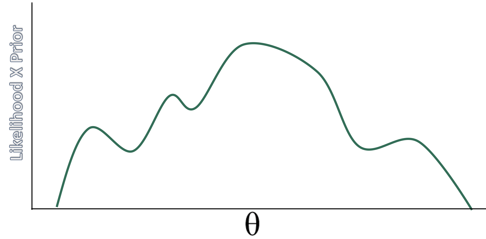
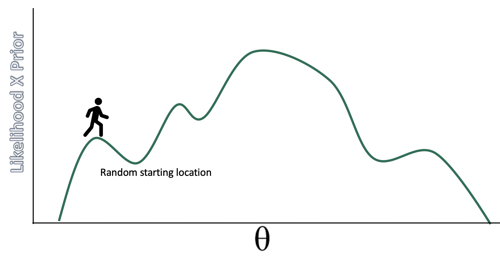
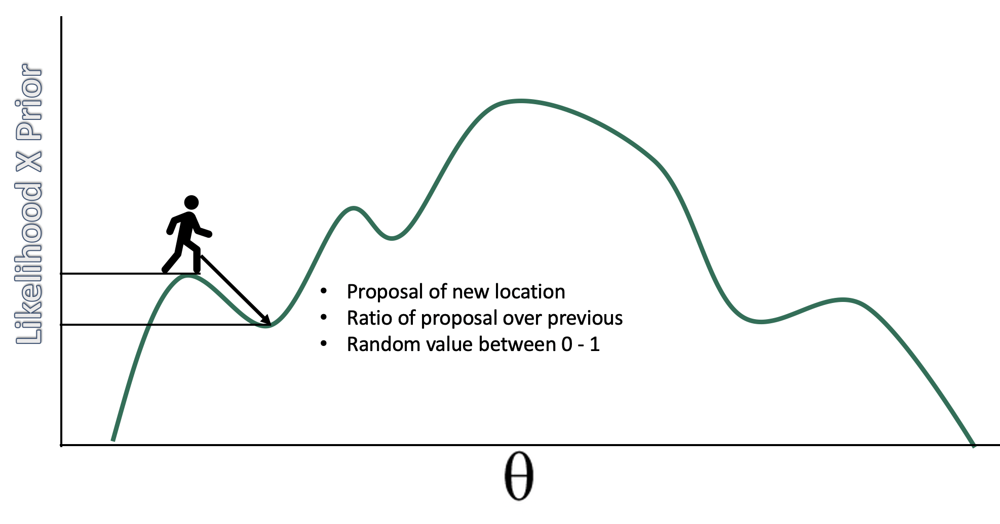
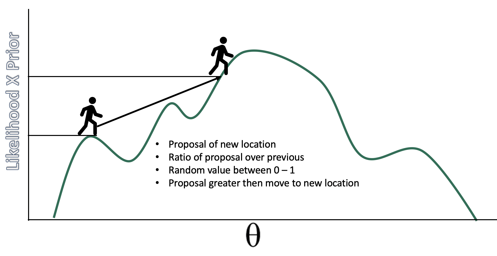
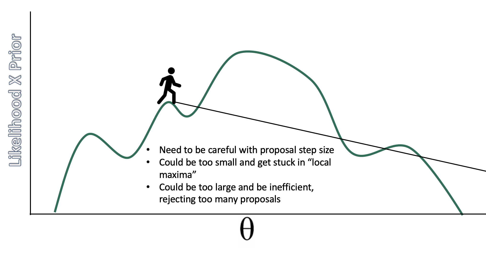
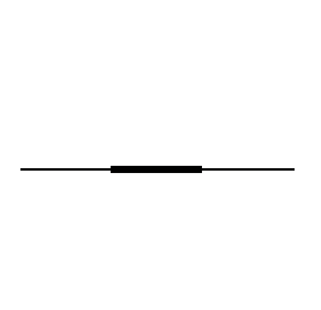
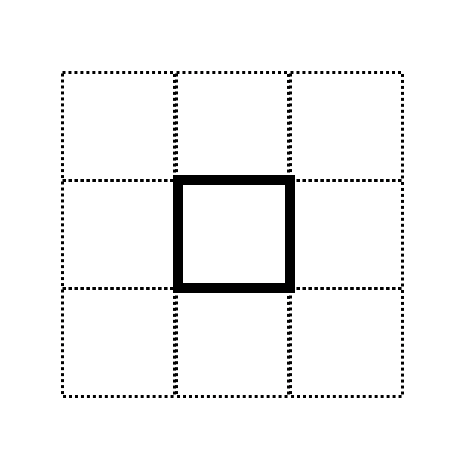

```{r setup, include=FALSE}
knitr::opts_chunk$set(echo = TRUE)
```

```{r xaringan-themer, include = FALSE}
library(xaringanthemer)
mono_light(
  base_color = "#23395b",
  header_font_google = google_font("Josefin Sans"),
  text_font_google   = google_font("Montserrat", "300", "300i"),
  code_font_google   = google_font("Droid Mono"),
)

library(tidyverse)
library(broom)
```


<style type="text/css">
.remark-slide-content {
    font-size: 30px;
    padding: 1em 4em 1em 4em;
}

.small .remark-code { 
  font-size: 80% !important;
}
.tiny .remark-code {
  font-size: 65% !important;
}
</style>


## How do we estimate the posterior? 

Grid, normal (quadratic) approximations, analytic/conjugate, MCMC, ABC

MCMC refers to a set of algorithms that sample from a probability distribution

Logic: if we don't know a distribution we draw samples from it. Instead of computations to directly specify the shape of the posterior, we get samples from this distribution and use these samples to describe the posterior. 

Think of marbles in the bag and "Bayesian inference is just counting example" -- we don't know what that looks like but we can sample from it to compute a posterior.

---
## Why this way? 
Short answer: computation is difficult. 

Computation of the posterior requires three terms: a prior, a likelihood and the evidence. The evidence (aka probability of the data; marginal likelihood) normalizes the posterior so it integrates (adds up) to 1. 

We assume a prior distribution and we can compute a likelihood based on what we know about the distribution we assumed for the DGP (most of the time). The tricky part is the evidence. This makes computation analytically intractable.  

$$ p(x) = \int_\theta p(x|\theta)p(\theta)d(\theta) $$


---
### Conjugate priors

With many parameters it is basically impossible to compute analytically. "Bayesian analysis is hard because integrals are hard". Maximization (derivatives) is easier than integrals, which is why frequentist is so popular. 

Conjugate priors are a less computational heavy approach to solving the integral problem. If posterior is from the same family as prior then it is easier to compute the evidence. Eg. prior is normal, posterior is normal. For something like sigma, people use gamma and gamma. As a result the posterior, p( $\theta$ | data), becomes analytically tractable. 


---

$$p(\theta | data) \propto \frac{p(data | \theta) \times p(\theta )}{p(data)}$$

The evidence is a constant with respect to $\theta$ so the equation is often presented as: 

$$ p(\theta | data) \propto p(data | \theta) \times p(\theta ) $$
As long as we can calculate the right side of the equation we can then sample from the posterior distribution

---
## Markov Chain Monte Carlo

Markov Chain: random process that undergoes transitions between states where the current state depends on the previous state. This is considered "memory less" because any state more than 1 away from each other is unrelated. 

Monte Carlo: Famous casino in Monaco. Used here to refer to repeated random sampling, like tossing dice

In the limit, the samples generated by the MCMC method will be samples from the target (posterior in our case) distribution. Note that the shape of the posterior does not have to be defined by a known probability distribution -- it can take any shape. 


---
## MCMC

Refers to a series of different algorithms. Metropolis, Gibbs, Hamiltonian are the most popular and historically relevant. 

Stan uses Hamiltonian
JAGS (in Krushke's DBDA) stands for Just Another Gibbs Sampler
BUGS (Bayesian inference Using Gibbs Sampling) was recently popular

---
## Metropolis

.pull-left[
Played a role in developing the thermonuclear bomb with one of the earliest computers. Published in 1953 but ignored within stats b/c it was published within a physics/chemistry journal. Took about until 1990 for desktop computers to run fast enough to do at home. 
]

.pull-right[
Steps of algorithm: 
1. Sample a value of $\theta$ 
2. Propose a new value centered on old + noise N(0, $\sigma$ )
3. Calculate likelihood*prior of proposal
4. Divide proposal value by current value
5. Sample from runif(1)
6. If proposal is greater, move. If not, stay. 

]


---

```{r echo=FALSE, out.height=550, out.width= 850}

```


---


```{r echo=FALSE, out.height=550, out.width= 850}

```


---

```{r echo=FALSE, out.height=550, out.width= 850}

```


---

```{r echo=FALSE, out.height=550, out.width= 850}

```


---

```{r echo=FALSE, out.height=550, out.width= 850}

```


---
## samples in the long run...

.pull-left[
...will approximate the posterior distribution. The resulting chain will have the correct density in proportion to the posterior distribution. ]

.pull-right[

```{r, echo = FALSE}
num <- 1000
positions <- rep(0, num) 
current   <- 10

for (i in 1:num) {
  
  # record current position 
  positions[i] <- current
  # flip coin to generate proposal
  proposal <- current + sample(c(-1, 1), size = 1)
  # now make sure he loops around the archipelago 
  if (proposal < 1) proposal <- 10
  if (proposal > 10) proposal <- 1
  # move?
  prob_move <- proposal/current
  current <- ifelse(runif(1) < prob_move, proposal, current)
  
}  

library(tidyverse)

tibble(week   = 1:1000,
       iteration = positions) %>%
  ggplot(aes(x = week, y = iteration)) +
  geom_point(shape = 1) +
  scale_x_continuous(breaks = seq(from = 0, to = 1000, by = 100)) +
  scale_y_continuous(limits = c(-2, 13), breaks = seq(from = -2, to = 15, by = 2)) +
  coord_cartesian(xlim = c(0, 1000)) +
  labs(title = "Metropolis algorithm")+
  xlab("iteration") + ylab("value")


```
]

---

```{r, echo = FALSE}
tibble(week   = 1:1000,
       iteration = positions) %>%
  ggplot(aes(x= iteration)) +
  geom_density() +
  scale_x_continuous(breaks = seq(from = -0, to = 10, by = 1)) 


```

---
## Multivariate posterior distributions

.pull-left[Posteriors are not simple hill climbing exercises, instead they represent high dimensional spaces. These high dimensional spaces make it such that there is a lot of space to explore. 

To visualize posteriors we usually "marginalize" them, that is, visualize them averaged across other posteriors. ]


.pull-right[
```{r, message = FALSE, warning=FALSE, echo = FALSE}
data <- "https://raw.githubusercontent.com/josh-jackson/bayes/master/week3.csv"

data <- read.csv(data) %>% 
  select(-ID, -SES)

library(ggExtra)

p <- ggplot(data, aes(x=friends, y=health)) +
      geom_point() +
      theme(legend.position="none")

p2 <- ggMarginal(p, type="density")
p2
```

]

---

```{r, echo = FALSE, warning = FALSE, message = FALSE}
samples = 200
r = 0.93

library('MASS')
cor.dat = mvrnorm(n=samples, mu=c(0, 0), Sigma=matrix(c(1, r, r, 1), nrow=2), empirical=TRUE)
X = cor.dat[, 1]  # standard normal (mu=0, sd=1)
Y = cor.dat[, 2]  # standard normal (mu=0, sd=1)

cor <- tibble(X,Y)

cor %>% 
  ggplot(aes(x = X, y = Y, fill = stat(density))) +
  stat_density_2d(geom = "raster", contour = F) +
  scale_fill_viridis_c(option = "D") +
  labs(x = expression(theta[1]),
       y = expression(theta[2])) +
  coord_equal() 


detach(package:MASS, unload=TRUE)
```


---
## Gibbs

To explore a high dimensional space we need to be savvy about our proposals. Especially, when we are drawing samples for each parameter given a specific value of another parameter

Like metropolis, Gibbs "guesses and checks," but has more adaptive proposals so as to not explore (and reject) so much space, leading to more efficient sampling.

Faster than Metropolis (and really probably good enough for most linear regressions) 

---
.pull-left[

But, but this efficient sampling can go awry and result in slow sampling, regardless of step size. If step size is too low, it takes a lot of samples to explore the space. If too large, there are too many rejections. 

So you need to "tune" your algorithm. 

]

.pull-right[

```{r, echo = FALSE, message = FALSE}
samples = 200
r = 0.93

library('MASS')
cor.dat = mvrnorm(n=samples, mu=c(0, 0), Sigma=matrix(c(1, r, r, 1), nrow=2), empirical=TRUE)
X = cor.dat[, 1]  # standard normal (mu=0, sd=1)
Y = cor.dat[, 2]  # standard normal (mu=0, sd=1)

cor <- tibble(X,Y)

cor %>% 
  ggplot(aes(x = X, y = Y, fill = stat(density))) +
  stat_density_2d(geom = "raster", contour = F) +
  scale_fill_viridis_c(option = "D") +
  labs(x = expression(theta[1]),
       y = expression(theta[2])) +
  coord_equal() 


detach(package:MASS, unload=TRUE)
```

]

---
## A website to visualize the sampling process

https://chi-feng.github.io/mcmc-demo/app.html


---
### Concentration of measure
.pull-left[With high dimensional posteriors we need a different approach than guess and check. Becomes inefficient with greater rejections or exploration of same space. 

Cannot just focus on the mode, we need to focus on the volume. The volume is an important part of the integral we are trying to solve with MCMC. Most of the volume in away from the mode. 
]

.pull-right[
```{r echo=FALSE, out.height=550, out.width= 850}

```

]

---
.pull-left[
```{r echo=FALSE, out.height=550, out.width= 850}

```

]


.pull-right[
```{r echo=FALSE, out.height=550, out.width= 850}
knitr::include_graphics("../media/met8.png")
```

]

---
## Hamiltonian MCMC

A different approach to guess and check; a physics simulation!

Pretend you have a hockey puck and flick it on an air hockey table that represent the minus log of the posterior (for a gaussian this would be a valley or a bowl). After a flick, we will record the position after a certain time. No rejections (almost)! Depending the topography the puck will go slower or faster and change direction. 

Proposals based on the `gradient`, which is just the slope via derivative. 

---
## Visualize H-MCMC

https://chi-feng.github.io/mcmc-demo/app.html


---

Depends on the curvature or gradient in the posterior. How do we calculate that? Derivatives. Lots of them. But those are relatively simple. (auto-diff)

And isn't that calculation a calculation of the posterior in and of itself? 
Nope. Its just local estimation of the curvature. This makes it tractable. The samples give us a full picture of the posterior.   

---
## Can we ensure accurate posteriors? 

Two key points: 

1. It is iterative, does not create the posterior distribution, instead it results in samples. 

2. It is stochastic. This means you wont get the same result each time. 

So we need to make sure that the algorithm "works" in that there are enough samples to get a good picture of the posterior, and that the samples will replicate across different attempts. 

---
## How many iterations do you need?

More iterations = more accurate posterior estimates. 
Total (usable) iterations = (Iterations - warm up samples)*chains  

Effective sample size ~= Iterations divided by autocorrelation. Can have greater than the number iterations due to `negative correlations` (this is good!). Referred to as Bulk_ESS in `brms` and N_eff in older versions.

Tail_ESS is similar but it is used more for CIs. The convergence of Markov chains are not uniform across the parameter. Mean estimates (mode median) should use Bulk_ESS whereas if you want to work with CIs (and you should!) look at N_EFF.

---
```{r, echo = FALSE}
library(tidyverse)
library(brms)

data <- "https://raw.githubusercontent.com/josh-jackson/bayes/master/week3.csv"

week3 <- read.csv(data) %>% 
  dplyr::select(-ID, -SES)


h.3 <- 
  brm(family = gaussian,
      health ~ 0 + mood.group.d,
      prior = c(prior(normal(0, 10), class = b),
                prior(cauchy(0, 10), class = sigma)),
      data = week3,
      iter = 1000, warmup = 500, chains = 2, cores = 2, 
      file = "h.3")
summary(h.3)

```

---
## auto regressive correlation across chains
```{r, echo = FALSE, message=FALSE}
library(bayesplot)
post <- posterior_samples(h.3, add_chain = TRUE)
post %>% 
  select(b_mood.group.dcontrol,b_mood.group.dtx, sigma) %>% 
mcmc_acf()
```

---
## How many chains do you need?

You need enough chains to chains to check convergence (below). Practically, the number of chains depends on 1) how many cores your computer has and 2) how much time you have. Conceivably you could run 100 chains. The problem though is this is wasteful computationally, as you will discard more warmup iterations. 

The Stan team suggests that 4 chains are adequate for checking convergence. `brms` defaults are iter = 2000 and warmup = 1000 which yields 4000 usable posterior samples. 

When setting up models: `one short chain to debug, four chains for verification and inference`


---
## Checking convergence

.pull-left[
Convergence is to a target distribution (the required posterior), not to a single value as in ML methods. 

First step is to look for fuzzy caterpillars (mixing, stationarity, and convergence) in the trace plots. Note that our warm up samples are not visualized.  

]

.pull-right[
```{r, echo = FALSE}
plot(h.3)
```


]

---

```{r}
pairs(h.3)
```


---
## R-hat

Ratio of variances between and within chain. 

1 indicates that there are no differences across chains. 

'> 1.05 indicates that chains provide unequal information


---
## Fixing wild chains

Sometimes problems occur. 
1. Increase warmup
2. Increase samples
3. Change your model (priors or estimated parameters)
4. Modify H-MCMC sampler 

---
## Divergent transitions

Because this is a physics simulation, we can examine the "energy" of the hockey puck to see if our simulation goes wrong. This is a good property of H-MCMC; similar properties do not exist for other algorithms. 

```{r}
div.t <-
  brm(data = list(y = c(-1, 1)), 
      family = gaussian,
      y ~ 1,
      prior = c(prior(normal(0, 1000), class = Intercept),
                prior(exponential(0.0001), class = sigma)),
      iter = 2000, warmup = 1000, chains = 2,
      file = "div.t")
```

---
```{r, echo = FALSE}
summary(div.t)
```

---

```{r, echo = FALSE}
pairs(div.t, 
      np = nuts_params(div.t),
      off_diag_args = list(size = 1/4))
```

---
```{r, echo = FALSE}
plot(div.t)
```


---
## Leap Frog steps and NUTS

Need to figure out the correct 1) step size (time interval) and 2) number of leap frog steps (where the gradients are calculated).  

Step size is done through warm up samples. 

Number of steps is done with NUTS, the No U-Turn Sampler. It makes sure that your puck does not end up in the same place it started. It does so by running the simulation in two directions. Provides optimal number of steps specific to the gradient you are currently in. 

---

If dealing with divergent transitions, increasing the acceptance probability during warm up will result in smaller steps (smaller time interval) and a longer sampling time.

```{r, eval = FALSE}
h.3 <- 
  brm(family = gaussian,
      health ~ 0 + mood.group.d,
      prior = c(prior(normal(0, 10), class = b),
                prior(cauchy(0, 10), class = sigma)),
      data = week3,
      iter = 1000, warmup = 500, chains = 2, cores = 2, 
      control = list(adapt_delta = .95), # default is .8 
      file = "h.3")
summary(h.3)
```


---
## tree depth

Divergent transitions are a validity concern, hitting the maximum treedepth is an efficiency concern. When the maximum allowed tree depth is reached it means the H-MCMC sampler is terminating to avoid excessively long execution time. Treedepth is associated with setps via: 2^treedepth, wiht 2^10 = 1024 leapfrog steps the default.


```{r, eval = FALSE}
h.3 <- 
  brm(family = gaussian,
      health ~ 0 + mood.group.d,
      prior = c(prior(normal(0, 10), class = b),
                prior(cauchy(0, 10), class = sigma)),
      data = week3,
      iter = 1000, warmup = 500, chains = 2, cores = 2, 
      control = list(max_treedepth = 15), # default is 10
      file = "h.3")
summary(h.3)
```
