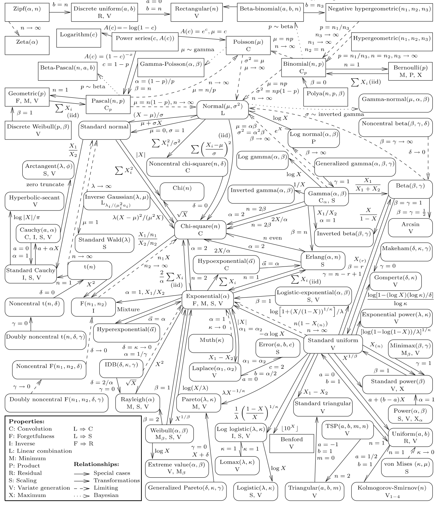
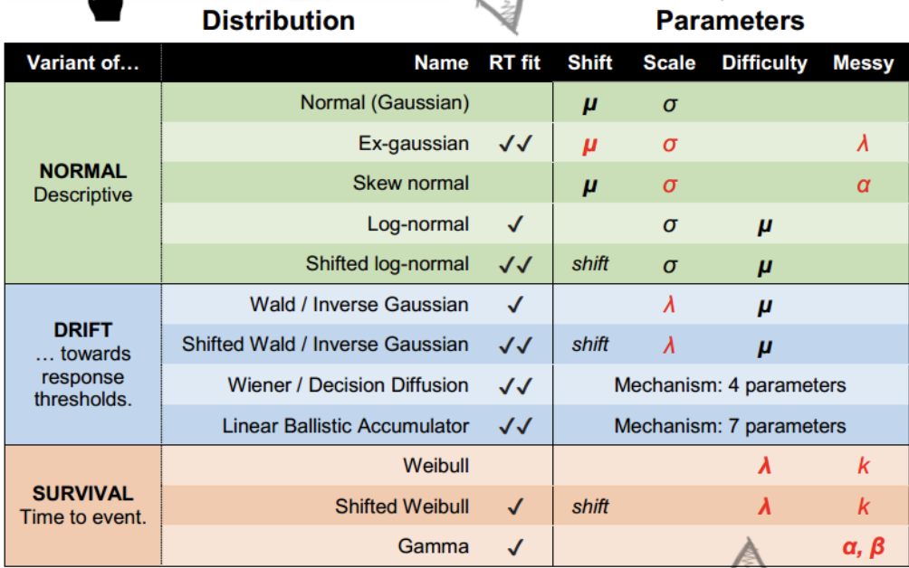
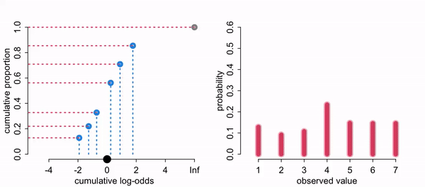

```{r setup, include=FALSE}
knitr::opts_chunk$set(echo = TRUE)
```
```{r xaringan-themer, include = FALSE}
library(xaringanthemer)
mono_light(
  base_color = "#23395b",
  header_font_google = google_font("Josefin Sans"),
  text_font_google   = google_font("Montserrat", "300", "300i"),
  code_font_google   = google_font("Droid Mono"),
)

library(tidyverse)
library(broom)
library(tidybayes)
library(modelr)
```

<style type="text/css">
.remark-slide-content {
    font-size: 30px;
    padding: 1em 4em 1em 4em;
}

.small{ 
  font-size: 80%}
.tiny{
  font-size: 65%}
</style>


## This time: 

work with distributions other than gaussian/t

introduce glm familes with link functions


---
## Generalized linear model

Used to describe different Data Generating Processes (DGPs) other than Gausian normal. That is a different likelihood estimation. 

Need to use if we cannot use the Gaussian normal e.g. the range of Y is restricted (e.g. binary, count) and/or the variance of Y depends on the mean. 

Often there is a maximum entropy distribution that serves as the default likelihood, helping us guide our choice. 


---

Need to: 

1. Specify your DGP distribution (likelihood)

2. Specify a link function. We do this so we can continue to use a typical linear regression model. Our parameters are now often non-linear, so we need to map a non-linear relationship to a linear one.


---
## Binomial

$$y_i \sim \operatorname{Binomial} (n, p_i)$$

$$f(p_i) = \alpha + \beta (x_i - \bar x)$$
The f of the $f(p_i)$ is a link function. Typically we use a logistic link. 

Link function is needed because the shape of the Binomial distribution is determined by two parameters, neither equivalent to the Gaussian mean (which the right side of the equation is based on). The link function also ensures the model doesn’t make improper probability predictions (ie outside of 0-1)

---
## Link function for binomial
Our number of trials is a fixed N, (here it is 1, a Bernoulli) so we are predicting the probability of y. Probabilities are bounded between 0 and 1 
 
Because our variables are not in probability units we need to "link" them via a function. The linear right side of the equation is not in the same units as the non-linear left side.  Instead of predicting probabilities directly, we are instead predicting the log of the odds. Other link functions: probit, negative inverse, cloglog. 

---

We need to map the s shaped ogive that goes between (0,1) to linear looking line that falls between $(-\infty, \infty)$ Think of it as a transformation of Y-hats
$$f(p) = logit(p) = log (\frac {p_{i}}{1-p_{i}})$$

Logits are now in a shape similar to a normal regression (ie a line/plane that goes from negative to positive infinity)

---
## inverse link

It is easier to think of transforming the probabilities but computationally the right side of the equation usually gets transformed. Note these two are equivalent. 

$$f(p_i) = \alpha + \beta (x_i - \bar x)$$

$$p_i = f^{-1}(\alpha + \beta (x_i - \bar x))$$

You already know this, maybe not in this term, but we can go back and forth between the link and inverse link via the exponential function. 

---
## Maximum Entropy
For an outcome variable that is continuous and far from any theoretical maximum or minimum, Gaussian model has maximum entropy. But when the outcome variable is either discrete or bounded, a Gaussian likelihood is not the most powerful choice. 

---
.pull-left[The distribution that can happen the greatest number of ways is the most plausible distribution. Call this distribution the maximum entropy distribution

Here it is the uniform
]

.pull-right[
```{r, echo = FALSE, warning = FALSE, message= FALSE}
library(tidyverse)
library(brms)
```


```{r, echo = FALSE, messages = FALSE}

d <-
  tibble(a = c(0, 0, 10, 0, 0),
         b = c(0, 1, 8, 1, 0),
         c = c(0, 2, 6, 2, 0),
         d = c(1, 2, 4, 2, 1),
         e = 2) 

d %>% 
  mutate(bucket = 1:5) %>% 
  gather(letter, pebbles, - bucket) %>% 
  
  ggplot(aes(x = bucket, y = pebbles)) +
  geom_col(width = 1/5) +
  geom_text(aes(y = pebbles + 1, label = pebbles)) +
  geom_text(data = tibble(
    letter  = letters[1:5],
    bucket  = 5.5,
    pebbles = 10,
    label   = str_c(c(1, 90, 1260, 37800, 113400), 
                    rep(c(" way", " ways"), times = c(1, 4)))),
    aes(label = label), hjust = 1) +
  scale_y_continuous(breaks = c(0, 5, 10))  +
  facet_wrap(~letter, ncol = 2)

```
]

---

If all we are willing to assume about a collection of measurements is that they have a finite variance, then the Gaussian distribution represents the most conservative probability distribution to assign to those measurements. With different assumptions, provided our assumptions are good ones, the principle of maximum entropy leads to distributions other than the Gaussian

Assumptions about your DGP should specify your likelihood function. NOT YOUR OBSERVED DISTRIBUTION OF DATA. 

There is a folk understanding about different types of data and the distributions used e.g., counts we use poisson. Usually this folk knowledge aligns with the principle of maximum entropy

---
## Exponential Family

```{r, echo = FALSE}
library(patchwork)

E1 <- ggplot(data.frame(x = c(0, 15)), aes(x = x))  +
    stat_function(fun = dexp, args = (mean=0.2), geom = "area", fill = "blue", alpha = 0.25) + ggtitle("Exponential with lambda = 0.2") 

G1 <- ggplot(data.frame(x = c(0, 5)), aes(x = x))  +
    stat_function(fun = dgamma, args=list(shape=2, rate=2), geom = "area", fill = "blue", alpha = 0.25) + ggtitle("Gamma with lambda = 2, kappa = 2") 

p1 <- tibble(x = 0:12) %>% 
  mutate(density = dpois(x, lambda = 3),
         strip   = "y %~% Poisson(lambda)") %>% 
  ggplot(aes(x = x, y = density)) +
  geom_col(fill = "blue", alpha = 0.25,width = 1/2) +
  ggtitle("Poisson with lambda = 3") 

b1 <-tibble(x = 0:10) %>% 
  mutate(density = dbinom(x, size = 10, prob = .3),
         strip   = "y %~% Binomial(n, p)") %>% 
  ggplot(aes(x = x, y = density)) +
  geom_col(fill = "blue", alpha = 0.25, width = 1/2) +
  ggtitle("binomial with N = 10, p = .3") 

(E1 + G1) /
  (p1 + b1)
```

---

Exponential is constrained to be above zero. If probability of some event is constant, it tends to follow an exponential. Used a lot in survival models. 

Gamma is positive but allowed to have a maximum that is not zero. This results when 2 or more exponential processes combine. Finance uses this a lot. 

Poisson for counts, when p is low and or number of trials is considered infinite. Special case of binomial. Used a lot in health, epidemiology and sport applications where counts are used. 

---


```{r echo=FALSE, out.height=550, out.width= 850}

```


---
## brms families

gaussian, student, binomial, bernoulli, poisson, negbinomial, geometric, gamma, skew_normal, lognormal, shifted_lognormal, exgaussian, wiener, inverse.gaussian, exponential, weibull, frechet, Beta, dirichlet, von_mises, asym_laplace, gen_extreme_value, categorical, multinomial, cumulative, cratio, sratio, acat, hurdle_poisson, hurdle_negbinomial, hurdle_gamma, hurdle_lognormal, zero_inflated_binomial, zero_inflated_beta, zero_inflated_negbinomial, zero_inflated_poisson, and zero_one_inflated_beta

---
common RT distributions

```{r echo=FALSE, out.height=500, out.width= 800}

```

---
## Example

```{r, echo = FALSE, message = FALSE}
library(readr)
mortality <- read_csv("https://raw.githubusercontent.com/josh-jackson/bayes/master/static/Lectures/mortality.csv")

```

```{r}
mortality <- mortality %>% 
  mutate(IQ_c = IQ - mean(IQ))
mortality
```


---

$$P.Death_i  \sim \operatorname{Binomial} (1, p_i)$$   

$$\operatorname{logit} (p_i)= \beta_0 + \beta_1*IQ_c $$ 
$$\beta_0\sim \operatorname{Normal} (0, ?)$$
$$\beta_1\sim \operatorname{Normal} (0, ?)$$

---
```{r}
glm.1 <-
  brm(family = binomial,
      NOT.premature | trials(1) ~ 1,
      prior(normal(0, 10), class = Intercept),
      sample_prior = T,
      data = mortality,
      file = "glm.1")
```


---
.pull-left[
```{r}
prior_draws(glm.1) 
```
]


.pull-right[
```{r}
prior_draws(glm.1) %>% 
  mutate(p = inv_logit_scaled(Intercept)) %>% 
  ggplot(aes(x = p)) +
  geom_density( )
```

]


---
Before we see the data do we think that the event happens all the time time or never? 

---

```{r}
glm.2 <-
  brm(family = binomial,
      NOT.premature | trials(1) ~ 1,
      prior(normal(0, 2), class = Intercept),
      sample_prior = T,
      data = mortality,
      file = "glm.2")
```


---

```{r}
prior_draws(glm.2) %>% 
  mutate(p = inv_logit_scaled(Intercept)) %>% 
  ggplot(aes(x = p)) +
  geom_density( )
```


---

Sees extreme values as a little more likely than equal odds. Is this reasonable? Depends! Maybe we want a prior that is closer to .5, with less mass in the extremes. Try N(0,1)

---

```{r}
glm.3 <-
  brm(family = bernoulli(link = "logit"),
      NOT.premature ~ 1 + IQ_c,
      prior = c(prior(normal(0, 2), class = Intercept),
      prior(normal(0, 3), class = b)),
      sample_prior = T,
      data = mortality,
      file = "glm.3")
```


---

```{r}
prior_draws(glm.3) 

```


---
.pull-left[
```{r, eval = FALSE}
prior_draws(glm.3)%>% 
  sample_n(size = 100) %>% 
  rownames_to_column("draw") %>% 
  expand(nesting(draw, Intercept, b),
         a = c(-9, 9)) %>% 
  mutate(d = Intercept + b * a) %>% 
  ggplot(aes(x = a, y = d)) +
  geom_line(aes(group = draw), alpha = .4) +
  labs(x = "IQ",
       y = "logit(Not-premature dealth)") +
  coord_cartesian(ylim = c(-10, 10)) +
  theme_bw() +
  theme(panel.grid = element_blank()) 
```
]

.pull-right[
```{r, echo = FALSE}
prior_draws(glm.3)%>% 
  sample_n(size = 100) %>% 
  rownames_to_column("draw") %>% 
  expand(nesting(draw, Intercept, b),
         a = c(-9, 9)) %>% 
  mutate(d = Intercept + b * a) %>% 
  ggplot(aes(x = a, y = d)) +
  geom_line(aes(group = draw), alpha = .4) +
  labs(x = "IQ",
       y = "logit(Not-premature dealth)") +
  coord_cartesian(ylim = c(-10, 10)) +
  theme_bw() +
  theme(panel.grid = element_blank()) 
```
]

---
.pull-left[
scaled to probability
```{r, eval = FALSE}

a <- seq(-9,9, .2)

prior_draws(glm.3)%>% 
  sample_n(size = 100) %>% 
  rownames_to_column("draw") %>% 
  expand(nesting(draw, Intercept, b), a) %>% 
  mutate(d = inv_logit_scaled(Intercept + b * a)) %>% 
  ggplot(aes(x = a, y = d)) +
  geom_line(aes(group = draw), alpha = .4) +
  labs(x = "IQ",
       y = "prob(Not-premature dealth)") +
  coord_cartesian(ylim = c(0, 1))
```
]

.pull-right[
```{r, echo = FALSE}

a <- seq(-9,9, .2)

prior_draws(glm.3)%>% 
  sample_n(size = 100) %>% 
  rownames_to_column("draw") %>% 
  expand(nesting(draw, Intercept, b), a) %>% 
  mutate(d = inv_logit_scaled(Intercept + b * a)) %>% 
  ggplot(aes(x = a, y = d)) +
  geom_line(aes(group = draw), alpha = .4) +
  labs(x = "IQ",
       y = "prob(Not-premature dealth)") +
  coord_cartesian(ylim = c(0, 1))
```

]

---

```{r}
summary(glm.3)
```

---
Instead of normal(0, 3), lets try normal(0, .5) for our prior

```{r}
glm.4 <-
  brm(family = bernoulli(link = "logit"),
      NOT.premature ~ 1 + IQ_c,
      prior = c(prior(normal(0, 2), class = Intercept),
      prior(normal(0, .5), class = b)),
      sample_prior = T,
      data = mortality,
      file = "glm.4")
```


---

.pull-left[
```{r, eval = FALSE}

a <- seq(-9,9, .2)

prior_draws(glm.4)%>% 
  sample_n(size = 100) %>% 
  rownames_to_column("draw") %>% 
  expand(nesting(draw, Intercept, b), a) %>% 
  mutate(d = inv_logit_scaled(Intercept + b * a)) %>% 
  ggplot(aes(x = a, y = d)) +
  geom_line(aes(group = draw), alpha = .4) +
  labs(x = "IQ",
       y = "prob(Not-premature dealth)") +
  coord_cartesian(ylim = c(0, 1))
```
]


.pull-right[
```{r, echo = FALSE}

a <- seq(-9,9, .2)

prior_draws(glm.4)%>% 
  sample_n(size = 100) %>% 
  rownames_to_column("draw") %>% 
  expand(nesting(draw, Intercept, b), a) %>% 
  mutate(d = inv_logit_scaled(Intercept + b * a)) %>% 
  ggplot(aes(x = a, y = d)) +
  geom_line(aes(group = draw), alpha = .4) +
  labs(x = "IQ",
       y = "prob(Not-premature dealth)") +
  coord_cartesian(ylim = c(0, 1))
```

]

---

```{r}
summary(glm.4)
```

---
Interpretation of coefficients is not straight forward. Easier to plot predictions. 

Why are they hard? 1. Logits, not in natural scale 2. Nonlinear association in natural scale. 3. predicted values depend on multiple variables.

---

```{r}
tibble(b0     = 1.62,
       b1     = .08,
       IQ_c = c(-6,-2,0,2,6)) %>% 
  mutate(logit_mu = b0 + b1 * IQ_c ) %>%
  mutate(Not_premature   = 1 / (1 + exp(-logit_mu)))
```


---
```{r}
plot(glm.4)
```

---
```{r}
pp_check(glm.4)
```


---
.pull-left[
```{r, eval = FALSE, message= FALSE, warning=FALSE}
library(tidybayes)
library(modelr)

mortality %>%
   data_grid(IQ_c = seq_range(IQ_c, n = 100)) %>%
  add_epred_draws(glm.4) %>%
  sample_draws(100) %>% 
    ggplot(aes(y = .value, x = IQ_c)) +
  geom_line(aes(y = .epred, group = .draw),
            color = "grey50", size = 1/3, alpha = 2/3) +
  ylim(0,1) + geom_point(data = mortality, 
               aes(y = NOT.premature),
               alpha = .3)
```
]

.pull-right[
```{r, echo = FALSE, messages = FALSE, warnings = FALSE}
mortality %>%
   data_grid(IQ_c = seq_range(IQ_c, n = 100)) %>%
  add_epred_draws(glm.4) %>%
  sample_draws(100) %>% 
    ggplot(aes(y = .value, x = IQ_c)) +
  geom_line(aes(y = .epred, group = .draw),
            color = "grey50", size = 1/3, alpha = 2/3) +
  ylim(0,1) + geom_point(data = mortality, 
               aes(y = NOT.premature),
               alpha = .3)
```
]

---
## epred vs prediction vs linear prediction

When we want to create fitted values we run into an extra complciation. Do we want to plot probabilities (original metric) or logits (our transformed metric)? We haven't had to deal with this prior because we didnt do any transformations with a gaussian normal. 

epred: give me the expectation on the response scale  
linpred: give me the expectation on the model's scale  
predict: give me a new observation (on the response scale)  

---
.pull-left[
```{r}
mortality %>%
  data_grid(IQ_c, .model = mortality) %>%
  add_epred_draws(glm.4) %>% 
  ungroup() %>% 
  select(.epred)
```
]


.pull-right[
```{r}

mortality %>%
  data_grid(IQ_c, .model = mortality) %>%
  add_linpred_draws(glm.4) %>% 
  ungroup() %>% 
  select(.linpred)
```
]


---
.pull-left[
```{r, eval = FALSE, message= FALSE, warning=FALSE}
mortality %>%
  data_grid(IQ_c = seq_range(IQ_c, n = 100)) %>%
  add_linpred_draws(glm.4) %>%
  sample_draws(100) %>% 
    ggplot(aes(y = .value, x = IQ_c)) +
  geom_line(aes(y = .linpred, group = .draw),
            color = "grey50", size = 1/3, alpha = 2/3) +
  ylab("logit") 
```
]

.pull-right[
```{r, echo = FALSE, messages = FALSE, warnings = FALSE}
mortality %>%
  data_grid(IQ_c = seq_range(IQ_c, n = 100)) %>%
  add_linpred_draws(glm.4) %>%
  sample_draws(100) %>% 
    ggplot(aes(y = .value, x = IQ_c)) +
  geom_line(aes(y = .linpred, group = .draw),
            color = "grey50", size = 1/3, alpha = 2/3) +
  ylab("logit") 
```
]

---
## Multinomial logistic regression
When you are predicting more than two groups (aka softmax regression aka categorical regression aka maximum entropy classifier)

Uses a multi-nomial distribution, which is a parent of the binomial distribution. Like the binomial but with more events. 

Need to construct K - 1 linear models for K events, similar to constructing number of dummy variables

---
### When would you use this?

Anytime people have more than two choices in some task. Trying to understand different demographic categories (race/ethnicity/gender identities/etc). 

Eg, does 401k amount predict whether someone at 62 is retired/part time/ still working? You could use 401k amount as the DV, with two dummy variables as predictors, but what if you wanted to control for years worked? Very different interpretations depending on what is your DV.  


---
## Multinomial example from SR
Career choice predicted by salary
```{r, echo = FALSE, message = FALSE}
library(rethinking)

# simulate career choices among 500 individuals
n      <- 500           # number of individuals
income <- c(1, 2, 5)    # expected income of each career
score  <- 0.5 * income  # scores for each career, based on income

# next line converts scores to probabilities
p <- softmax(score[1], score[2], score[3])

# now simulate choice
# outcome career holds event type values, not counts
career <- rep(NA, n)  # empty vector of choices for each individual

# sample chosen career for each individual
set.seed(123)
# sample chosen career for each individual
for(i in 1:n) career[i] <- sample(1:3, size = 1, prob = p)

d <-
  tibble(career = career) %>% 
  mutate(career_income = ifelse(career == 3, 5, career))

d %>%
  ggplot(aes(x = career)) +
  geom_bar(size = 0)

```


---

For K categories, we estimate K -1 linear models. Think of a logistic regression where K = 2, we fit just a single regression model. Here we are doing multiple regression models simultaneously within the same model. 


---
Intercept only model, where we will get two intercepts, because it is like we have two models
```{r}
glm.5 <-
  brm(family = categorical(link = logit, refcat = 3), # to match up with book
      career ~ 1,
      prior = c(prior(normal(0, 1), class = Intercept, dpar = mu1),
                prior(normal(0, 1), class = Intercept, dpar = mu2)),
      iter = 2000, warmup = 1000, cores = 4, chains = 4,
      data = d, 
      file = "glm.5")
```

---

```{r}
summary(glm.5)
```


---

```{r}
glm.5 %>% 
  spread_draws(b_mu1_Intercept, b_mu2_Intercept) %>% 
  mutate(b_mu3_Intercept = 0) %>% 
  mutate(p1 = exp(b_mu1_Intercept) / (exp(b_mu1_Intercept) + exp(b_mu2_Intercept) + exp(b_mu3_Intercept)),
         p2 = exp(b_mu2_Intercept) / (exp(b_mu1_Intercept) + exp(b_mu2_Intercept) + exp(b_mu3_Intercept)),
         p3 = exp(b_mu3_Intercept) / (exp(b_mu1_Intercept) + exp(b_mu2_Intercept) + exp(b_mu3_Intercept))) %>% 
  pivot_longer(p1:p3) %>% 
  group_by(name) %>% 
  mean_qi(value) %>% 
  mutate_if(is.double, round, digits = 2)
```
The same probabilities that we simulated with! 

---
mu1_Intercept coefficient is -2.01. What does that mean? 
```{r}

exp(-2.01)
```


```{r}
1/exp(-2.01)
```


---
### Adding a predictor

```{r}
b      <- c(-2, 0, 2)
family_income <- runif(n)


career <- rep(NA, n)  # empty vector of choices for each individual
for (i in 1:n) {
    score     <- 0.5 * (1:3) + b * family_income[i]
    p         <- softmax(score[1], score[2], score[3])
    career[i] <- sample(1:3, size = 1, prob = p)
}

d <-
  tibble(career = career) %>% 
  mutate(family_income = family_income)
d

```


```{r}
get_prior(data = d, 
          family = categorical(link = logit, refcat = 3), 
          career ~ 1 + family_income)
```


---
```{r}

glm.6 <-
  brm(family = categorical(link = logit, refcat = 3),
      career ~ 1 + family_income,
      prior = c(prior(normal(0, 1), class = Intercept, dpar = mu1),
                prior(normal(0, 1), class = Intercept, dpar = mu2),
                prior(normal(0, .5), class = b, dpar = mu1),
                prior(normal(0, .5), class = b, dpar = mu2)),
      iter = 2000, warmup = 1000, cores = 4, chains = 4,
      data = d, 
      file = "glm.6")

```

---
```{r}
summary(glm.6)
```


---
## GLMs for Counts
Binomial, Poisson, multinomial categorical

Geometric -- number of trials until an event  

Survival models  


---
## Mixtures

Often the DGP of our data are complex in that there could be multiple reasons someone responds the way they do. Mixture models allows us to fit more than one DGP at a time. 

We will focus on Zero inflated and Hurdle models. These models are helpful whenever there are more zeros in the response variable than one would naturally expect.

---
## Zero-inflated models
.pull-left[
Use when there are different causes for the same observation -- a mixture of DGPs. 

Lots of ways to get zero counts: 
Missed observation or the rate is low -- hard to distinguish. 
]

.pull-right[
```{r, echo = FALSE}

prob_drink <- 0.2  # 20% of days
rate_work  <- 1    # average 1 manuscript per day
# sample one year of production
n <- 365
# simulate days monks drink
set.seed(365)
drink <- rbinom(n, 1, prob_drink)
# simulate manuscripts completed
y <- (1 - drink) * rpois(n, rate_work)

zips <-
  tibble(drink = factor(drink, levels = 1:0), 
         y     = y)

ggplot(data = zips, aes(x = y)) +
  geom_histogram(aes(fill = drink),
                 binwidth = 1, size = 1/10, color = "grey92") +
  scale_fill_manual(values = 1:2) +
  xlab("Manuscripts completed") +
  theme(legend.position = "none")
```
]

---
### ZIP Zero inflated poisson
p = the probability of drinking (vs working). If drinking we know no manuscripts are created. If working, manuscripts still may not be created. That rate is modeled through lambda as a poisson, and a bernulli with a p  

$$\operatorname{Pr} (0 | p, \lambda)  = \operatorname{Pr} (\text{drink} | p) + \operatorname{Pr} (\text{work} | p) \times \operatorname{Pr} (0 | \lambda)$$
$$= p + (1 - p) \exp (- \lambda)$$

---

The probability of observing a zero is the probability that the monks didn’t drink OR the probability that the monks worked AND failed to finish anything

$$\operatorname{Pr} (y | y > 0, p, \lambda) = $$
$$ \operatorname{Pr} (\text{drink} | p) (0) + \operatorname{Pr} (\text{work} | p) \operatorname{Pr} (y | \lambda) = (1 - p) \frac {\lambda^y \exp (- \lambda)}{y!}$$
Since drinking monks never produce, the expression above is the chance the monks both work (1-p), and finish y manuscripts

---

$$y_i  \sim \operatorname{ZIPoisson} (p_i, \lambda_i)$$
$$\operatorname{logit} (p_i)      = \alpha_p + \beta_p x_i$$
$$\log (\lambda_i)  = \alpha_\lambda + \beta_\lambda x_i$$
---

```{r}
glm.9 <- 
  brm(family = zero_inflated_poisson,
      y ~ 1,
      prior = c(prior(normal(-1.5, 1), class = Intercept),
                prior(beta(2, 6), class = zi)),  # the brms default is beta(1, 1)
      iter = 2000, warmup = 1000, chains = 4, cores = 4,
      data = zips,
      file = "glm.9")
```

```{r, echo = FALSE}
zip.priors <-
  c(prior(beta(1, 1), class = zi),
    prior(beta(2, 6), class = zi))
zip.priors %>% 
  parse_dist(prior) %>%
  ggplot(aes(y = prior, dist = .dist, args = .args, fill = prior)) +
  stat_dist_halfeye(.width = .95) +
  scale_x_continuous("zi", breaks = c(0, .5, 1)) +
  ylab(NULL) +
  theme(legend.position = "none")
```

---
Noe: When there are no predictors for zi, the brms default is to use the identity link. With predictors it will use logit, so you will have to use what you know about logits to correctly interpret. 
```{r}
summary(glm.9)
```

---
Adding predictors. Do not necessarily need to have the same predictors for each process. One can predict the excess zeros, the other can predict the counts. 
```{r, eval = FALSE}
glm.9 <- 
  brm(family = zero_inflated_poisson,
      y ~ 1 + b, 
      zi ~ 1 + c,
      prior = c(prior(normal(-1.5, 1), class = Intercept),
                prior(beta(2, 6), class = zi)),  # the brms default is beta(1, 1)
      iter = 2000, warmup = 1000, chains = 4, cores = 4,
      data = zips,
      file = "glm.9")
```
Often the associations can go in different directions (because they are modeling different processes!)
---
## Hurdle models/zero augmented

Are also mixure (two-part) models that specifies one process for zero counts and another process for positive counts. The idea is that positive counts occur once a threshold is crossed. 


---

```{r}
glm.9h <- 
  brm(family = hurdle_poisson,
      y ~ 1, 
      prior = c(prior(normal(-1.5, 1), class = Intercept),
               prior(beta(1, 1), class = hu)),  
      iter = 2000, warmup = 1000, chains = 4, cores = 4,
      data = zips,
      file = "glm.9h")

```

---
```{r}
summary(glm.9h)
```

---
## Ordinal regression models

likert scales
never, sometimes, often
no degree, hs degree, some college, college degree

discrete, defined order, distance between categories is unknown

common assumption is to treat differences as the same and model as continuous with guassian 

---
### log cumulative odds link

.pull-left[ 


```{r, echo = FALSE}
library(rethinking)
data(Trolley)
trolley <- Trolley
p2a <-
  trolley %>%
  ggplot(aes(x = response)) +
  geom_histogram() 
p2a
```

]

.pull-right[
```{r, echo = FALSE}
p2 <-
  trolley %>%
  count(response) %>%
  mutate(pr_k     = n / nrow(trolley),
         cum_pr_k = cumsum(pr_k)) %>% 
  ggplot(aes(x = response, y = pr_k, 
             fill = response)) +
  geom_line() +
  geom_point(shape = 21, color = "grey92", 
             size = 2.5, stroke = 1) +
  scale_x_continuous(breaks = 1:8) +
  scale_y_continuous(" proportion", 
                     limits = c(0, .35)) +
  theme(axis.ticks = element_blank(),
        axis.title.y = element_text(angle = 90),
        legend.position = "none")

p2
```
]

--->
.pull-left[Cumulative proportion. Each choice is larger than the previous

```{r, echo = FALSE}
p2b <-
  trolley %>%
  count(response) %>%
  mutate(pr_k     = n / nrow(trolley),
         cum_pr_k = cumsum(pr_k)) %>% 
  ggplot(aes(x = response, y = cum_pr_k, 
             fill = response)) +
  geom_line() +
  geom_point(shape = 21, color = "grey92", 
             size = 2.5, stroke = 1) +
  scale_x_continuous(breaks = 1:8) +
  scale_y_continuous("cumulative proportion", 
                     breaks = c(0, .25, .5, .75, 1), limits = c(0, 1.1)) +
  theme(axis.ticks = element_blank(),
        axis.title.y = element_text(angle = 90),
        legend.position = "none")

p2b
```
]


.pull-right[
The cumulative probability of a value is the probability of that value or any smaller value. In the context of ordered categories, the cumulative probability of 3 is the sum of the probabilities of 3, 2, and 1
]

---
Logic:
Probability of any observation is just counting up the cumulative proportion for values to the left of the cut points. 

Thus option 1 refers to all values up to the first. Option two is values to the left of cut point 2 and to the right of cut point 1. 

We will discuss in terms of the probability of x being less than or equal to some cut point. 

Thus what is the probability of getting a 5? It is the cumulative probability of getting a 5 or less subtracting  the cumulative probability of getting a 4 or less. 


---
We can change this into cumulative log odds, where each response value is represented as a logit. 

This changes the x axis, making different cut points that represent the cumulative log odds of getting a 4, for example. 

The cumulative log odds of getting a 7 here cannot be determined because the logit of 1 is infinity. Logit of 0 represents 50% of our values. Logit of -2 almost none, logit of +2 almost all of our values. 

Why logits? Because we want to predict an ordered outcome. 

---
.pull-left[
We want to estimate the cutpoints

$$\log\left(\dfrac{Pr(y_i)}{Pr(y_i)}\right)=\log\left(\dfrac{Pr(y_i \leq k)}{1-Pr(y_i \leq k)}\right)$$
]

.pull-right[

```{r, echo = FALSE, message = FALSE, warning = FALSE}
p2b +  scale_x_continuous(breaks = c(.5,2,3.5,5,6.6), labels = c(-2,-1,0,1,2)) + xlab("cumulative log odds") +  theme(axis.title.y = element_blank(), axis.text.y = element_blank())
```


]


---

We will have intercepts for each response option, each on the log-cumulative-odds scale. They will be interpreted as the cumulative probability of each outcome.

 $\alpha_k$ is an “intercept” unique to each possible outcome value k. We estimating the probability of some response yi being equal or less than to some category. E.g., the cumulative probability of getting a 5? It is the proportion of values that are 5 or less.  

$$\log \frac{\operatorname{Pr}(y_i \leq k)}{1 - \operatorname{Pr}(y_i \leq k)} = \alpha_k$$

---

```{r}
logit <- function(x) log(x / (1 - x)) 
trolley %>%
  count(response) %>%
  mutate(pr_k     = n / nrow(trolley),
         cum_pr_k = cumsum(n / nrow(trolley))) %>% 
  mutate(alpha = logit(cum_pr_k) %>% round(digits = 2))
```

---

```{r, echo = FALSE}
p1 <-
  trolley %>% 
  ggplot(aes(x = response, fill = ..x..)) +
  geom_histogram(binwidth = 1/4, size = 0) +
  # scale_fill_gradient(low = "grey",
  #                     high = "black") +
  scale_x_continuous(breaks = 1:7) +
  theme(axis.ticks = element_blank(),
        axis.title.y = element_text(angle = 90),
        legend.position = "none")


p3 <-
  trolley %>%
  count(response) %>%
  mutate(cum_pr_k = cumsum(n / nrow(trolley))) %>% 
  filter(response < 7) %>% 
  ggplot(aes(x = response, y = logit(cum_pr_k), fill = response)) +
  geom_line() +
  geom_point(shape = 21, colour = "grey92", 
             size = 2.5, stroke = 1) +
  scale_x_continuous(breaks = 1:7, limits = c(1, 7)) +
  ylab("log-cumulative-odds") +
  theme(axis.ticks = element_blank(),
        axis.title.y = element_text(angle = 90), 
        legend.position = "none")

(p1 | p2 | p3) 

```

---

$$\text{response}_i  \sim \operatorname{Categorical} (\mathbf p) $$
$$\text{logit}(p_k)  = \alpha_k + \phi $$ 
$$\phi               = 0 $$
$$\alpha_k           \sim \operatorname{Normal}(0, 1.5)$$


Where $\phi$ is a stand in for regression terms. Right now it is an intercept only model. 
$\alpha_k$ are our k intercepts, make up for #categories minus 1. 


---
Note we specified a categorical one in the model statement. The brms code uses the term cumulative. And SR uses Ordered logit. All the same. 
```{r}
glm.10 <- 
  brm(family = cumulative,
      response ~ 1,
      prior(normal(0, 1.5), class = Intercept),
      iter = 2000, warmup = 1000, cores = 4, chains = 4,
      data = trolley, 
      file = "glm.10")
```


---

```{r}
summary(glm.10)
```

---
Bring back into cumulative proportions
```{r}
glm.10 %>% 
gather_draws(b_Intercept[cut]) %>% 
  mutate(.value = inv_logit_scaled(.value)) %>% 
  group_by(cut) %>% 
  summarise(mean = mean(.value),
            sd   = sd(.value),
            ll   = quantile(.value, probs = .025),
            ul   = quantile(.value, probs = .975))
```

---

Quicker way via brms functions to get it but note that the standard error isn't in the probability metric. 
```{r}
glm.10 %>% 
  fixef() %>% 
  inv_logit_scaled()
```

---
### adding predictors

```{r echo=FALSE, out.height=500, out.width= 800}

```


----
$$ \text{response}_i  \sim \operatorname{Categorical} (\mathbf p) $$
$$ \text{logit}(p_k)      = \alpha_k + \phi_i $$
$$  \phi_i = \beta_1 \text{action}_i + \beta_2 \text{contact}_i + \beta_3 \text{intention}_i + \beta_4 (\text{action}_i \times \text{intention}_i) + \beta_5 (\text{contact}_i \times \text{intention}_i) $$
$$\alpha_k               \sim \operatorname{Normal}(0, 1.5) $$
$$\beta_1, ..., \beta_5  \sim \operatorname{Normal}(0, 0.5) $$

---

```{r}
glm.11 <- 
  brm(family = cumulative,
      response ~ 1 + action + contact + intention + intention:action + intention:contact,
      prior = c(prior(normal(0, 1.5), class = Intercept),
                prior(normal(0, 0.5), class = b)),
      iter = 2000, warmup = 1000, cores = 4, chains = 4,
      data = trolley,
      file = "glm.11")
```

---

```{r}
summary(glm.11)
```

---
```{r, eval = FALSE, message = FALSE, warning = FALSE}
glm.11 %>% 
gather_draws(`b_action`,`b_contact`,`b_intention`,`b_action:intention`,`b_contact:intention`) %>% 
  ggplot(aes(x = .value, y = .variable)) +
  geom_vline(xintercept = 0, alpha = 1, linetype = 3) +
  stat_gradientinterval(.width = .95, point_size = 1, shape = 1) +
  scale_x_continuous("marginal posterior", breaks = -5:0 / 4) +
  coord_cartesian(xlim = c(-1.4, 0))

```

---

```{r, echo = FALSE, message = FALSE, warning = FALSE}
glm.11 %>% 
gather_draws(`b_action`,`b_contact`,`b_intention`,`b_action:intention`,`b_contact:intention`) %>% 
  ggplot(aes(x = .value, y = .variable)) +
  geom_vline(xintercept = 0, alpha = 1, linetype = 3) +
  stat_gradientinterval(.width = .95, point_size = 1, shape = 1) +
  scale_x_continuous("marginal posterior", breaks = -5:0 / 4) +
  coord_cartesian(xlim = c(-1.4, 0))

```

---

```{r, warning = FALSE, message= FALSE}
conditional_effects(glm.11, categorical =TRUE)
```

---

```{r, echo = FALSE}
nd <- 
  trolley %>% 
  distinct(action, contact, intention) %>% 
  mutate(combination = str_c(action, contact, intention, sep = "_"))

fit.11 <-
  fitted(glm.11,
         newdata = nd,
         summary = F)

fit.11 <-
  rbind(fit.11[, , 1],
        fit.11[, , 2],
        fit.11[, , 3],
        fit.11[, , 4],
        fit.11[, , 5],
        fit.11[, , 6],
        fit.11[, , 7]) %>% 
  data.frame() %>% 
  set_names(pull(nd, combination)) %>% 
  mutate(response = rep(1:7, each = n() / 7),
         iter     = rep(1:4000, times = 7)) %>% 
  pivot_longer(-c(iter, response),
               names_to = c("action", "contact", "intention"),
               names_sep = "_",
               values_to = "pk") %>% 
  mutate(intention = intention %>% as.integer())

levels <- c("action=0, contact=0", "action=1, contact=0", "action=0, contact=1")

  fit.11 %>% 
  filter(response < 7) %>% 
  mutate(facet = factor(str_c("action=", action, ", contact=", contact),
                        levels = levels)) %>% 
  group_by(iter, facet, intention) %>% 
  arrange(iter, facet, intention, response) %>% 
  mutate(probability = cumsum(pk)) %>% 
  ungroup() %>% 
  nest(data = -iter) %>% 
  sample_n(size = 50) %>%
  unnest(data) %>% 

  ggplot(aes(x = intention, y = probability)) +
  geom_line(aes(group = interaction(iter, response), color = probability),
            alpha = 1/10) +
  geom_point(data = trolley %>%  
               group_by(intention, contact, action) %>% 
               count(response) %>% 
               mutate(probability = cumsum(n / sum(n)),
                      facet = factor(str_c("action=", action, ", contact=", contact),
                                     levels = levels)) %>% 
               filter(response < 7),) +
  scale_x_continuous("intention", breaks = 0:1) +
  scale_y_continuous(breaks = c(0, .5, 1), limits = c(0, 1)) +
  theme(legend.position = "none") +
  facet_wrap(~facet)
```


---
### Unequal variances

The parameter related to latent variances is called disc (short for discrimination). 

```{r}
glm.12 <- 
  brm(family = cumulative,
      bf(response ~ 1 + action + contact + intention + intention:action + intention:contact) +
      lf(disc ~ 0 + action + contact + intention + intention:action + intention:contact, cmc = FALSE),
      prior = c(prior(normal(0, 1.5), class = Intercept),
                prior(normal(0, 0.5), class = b)),
      iter = 2000, warmup = 1000, cores = 4, chains = 4,
      data = trolley,
      file = "glm.12")
```

---
```{r}
summary(glm.12)
```


---
## Adjacent category /category specific models

Do you want to assume similar effects of your predictors across the range of your DV? Or does the effect occur only as certain differences between the categories? 

For example, predicting educational attainment. Negative peer influences may have a large effect at graduating HS but little effect compared to whether or not someone goes to graduate school. 


---
## Ordinal predictors

Say you have an excerise variable: (none, 1 time a month, 1 time a week, multiple times a week, everday). How do you model? Continuous? 

Cant you just model ordinal predictors as a series of dummy variables? But what is we want to force the inherent order? 

Monotonic. Think about as a compromise between continuous and dummy. We can not assume categories are equidistant with respect to their effect on the response variable (because then we would be using continuous). Instead, the distance between adjacent predictor categories (or integers) is estimated from the data and may vary across categories.


---
## extra readings

https://cran.r-project.org/web/packages/brms/vignettes/brms_monotonic.html

https://psyarxiv.com/9qkhj/


