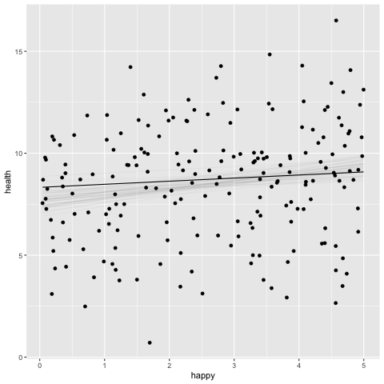

```{r setup, include=FALSE}
knitr::opts_chunk$set(echo = TRUE)
```

```{r xaringan-themer, include = FALSE}
library(xaringanthemer)
mono_light(
  base_color = "#23395b",
  header_font_google = google_font("Josefin Sans"),
  text_font_google   = google_font("Montserrat", "300", "300i"),
  code_font_google   = google_font("Droid Mono"),
)

library(tidyverse)
library(broom)
```


<style type="text/css">
.remark-slide-content {
    font-size: 30px;
    padding: 1em 4em 1em 4em;
}

.small .remark-code { 
  font-size: 80% !important;
}
.tiny .remark-code {
  font-size: 65% !important;
}
</style>


## Goals for this section
Go deeper into basic linear models to become comfortable with standard regressions

Again, we will walk through an example or two to help us along

---
## Example data
```{r, echo = FALSE}
library(tidyverse)
```


```{r}

data <- "https://raw.githubusercontent.com/josh-jackson/bayes/master/week3.csv"

week3 <- read.csv(data) %>% 
  select(-ID, -SES)

week3
```

---

```{r, echo = FALSE, message = FALSE, warning = FALSE}
library(GGally)
ggpairs(week3)

```

---
## Model

Health ~ Normal( $\mu_i$ , $\sigma$ )  

$\mu_i$ = $\beta_0$ + $\beta_1$ $Happy_i - {\overline{\mbox{Happy}}}  $    

$\beta_0$ ~ Normal(0, 5)   
$\beta_1$ ~ Normal(0, 5)   
$\sigma$  ~ HalfCauchy(0,10) 

---
## Prior Predictive Distribution

```{r, warning=FALSE, message = FALSE}

library(brms)

week3 <- week3 %>% 
  mutate(happy_c = happy - mean(happy))

prior.1 <- prior(normal(0, 5), class = Intercept) +
                prior(normal(0, 5), class = b) +
                prior(cauchy(0, 10), class = sigma)


h.1p <- 
  brm(family = gaussian,
      health ~ 1 + happy_c,
      prior = prior.1,
      data = week3,
      sample_prior = "only",
      iter = 1000, warmup = 500, chains = 2, cores = 2, 
      file = "h.1p")


```

---

.pull-left[
```{r, eval = FALSE, warning=FALSE, message = FALSE}
library(tidybayes)
prior.1 %>% 
  parse_dist(prior) %>% 
  ggplot(aes(y=class, dist =.dist, args=.args)) +
  stat_dist_halfeye()+
  scale_x_continuous( limits = c(-50, 50))+
  labs(title="Priors")
```
]

.pull-right[
```{r, echo= FALSE, warning=FALSE, message = FALSE}
library(tidybayes)
prior.1 %>% 
  parse_dist(prior) %>% 
  ggplot(aes(y=class, dist =.dist, args=.args)) +
  stat_dist_halfeye()+
  scale_x_continuous( limits = c(-50, 50)) +
  labs(title="Priors")
```
]


---

.pull-left[
```{r, message = FALSE, warning=FALSE}
pp_check(h.1p) + xlim(-50,50)
```
]

.pull-right[
This graphs 10 simulated datasets from posterior predictive distribution, compared to the our actual density distribution  

How is this the posterior predictive distribution if we just sampled from the prior? We treat the priors as if they were the posteriors.  

]

---
```{r, warning=FALSE, message = FALSE}
pp_check(h.1p,
         type = 'intervals')
```

---

```{r, eval = FALSE}

library(modelr)
labels <-  c(-2, -1, 0, 1, 2) + mean(week3$happy) %>%   round(digits = 0)
week3 %>% 
data_grid(happy_c = seq_range(happy_c, n = 101)) %>% 
 add_epred_draws(h.1p, ndraws = 100) %>% 
  ggplot(aes(x = happy_c, y = health)) +
  geom_line(aes(y = .epred, group = .draw), alpha = .1) +
  scale_x_continuous(breaks = c(-2, -1, 0, 1, 2), labels = labels) +
  xlab("happy")
```

---

```{r, echo = FALSE}

library(modelr)
labels <-  c(-2, -1, 0, 1, 2) + mean(week3$happy) %>%   round(digits = 0)
week3 %>% 
data_grid(happy_c = seq_range(happy_c, n = 101)) %>% 
 add_epred_draws(h.1p, ndraws = 100) %>% 
  ggplot(aes(x = happy_c, y = health)) +
  geom_line(aes(y = .epred, group = .draw), alpha = .1) +
  scale_x_continuous(breaks = c(-2, -1, 0, 1, 2), labels = labels) +
  xlab("happy")
```


---

```{r}
prior.2 <- prior(normal(0, 2), class = Intercept) +
                prior(normal(0, 2), class = b) +
                prior(cauchy(0, 1), class = sigma)
```


```{r, warning=FALSE, message = FALSE}
h.2p <- 
  brm(family = gaussian,
      health ~ 1 + happy_c,
      prior = prior.2,
      data = week3,
      sample_prior = "only",
      iter = 1000, warmup = 500, chains = 2, cores = 2, 
      file = "h.2p")
```


---

.pull-left[
```{r, echo= FALSE, warning=FALSE, message=FALSE}
library(tidybayes)
prior.2 %>% 
  parse_dist(prior) %>% 
  ggplot(aes(y=class, dist =.dist, args=.args)) +
  stat_dist_halfeye()+
  scale_x_continuous( limits = c(-25, 25)) +
  labs(title="skinnier priors")
```

]

.pull-right[
```{r, echo= FALSE, warning=FALSE, message = FALSE}
library(tidybayes)
prior.1 %>% 
  parse_dist(prior) %>% 
  ggplot(aes(y=class, dist =.dist, args=.args)) +
  stat_dist_halfeye()+
  scale_x_continuous( limits = c(-50, 50)) +
  labs(title="Priors")
```
]

---
.pull-left[
```{r, echo=FALSE, warning=FALSE, message = FALSE}
pp_check(h.2p) + xlim(-25,25)
```
]

.pull-right[
```{r, echo = FALSE, warning=FALSE, message = FALSE}
pp_check(h.2p,
         type = 'intervals')
```
]


---
## Fit model

```{r}
h.1 <- 
  brm(family = gaussian,
      health ~ 1 + happy_c,
      prior = c(prior(normal(0, 5), class = Intercept),
                prior(normal(0, 5), class = b),
                prior(cauchy(0, 10), class = sigma)),
      data = week3,
      iter = 1000, warmup = 500, chains = 2, cores = 2, 
      file = "h.1")
```


---
### view priors

```{r}
prior_summary(h.1)
```

---

```{r}
summary(h.1, prob = .99)
```

---
```{r}
library(broom)
tidy(lm(health ~ happy_c, data = week3))
```

```{r}
glance(lm(health ~ happy_c, data = week3))
```

---
```{r}
plot(h.1)
```

---
### what are chains? 

Chains are the different sampling processes occurring simultaneously. The default is 4 chains, with 1000 samples from each chain, resulting in 40,000 samples of the posterior. 

Each chain is independent of other chains so as to ensure that the procedure can replicate 

---
## The posterior is made of samples

```{r}
library(tidybayes)
p.h1 <- h.1 %>% 
spread_draws(b_Intercept, b_happy_c, sigma)
p.h1
```

---
```{r}
p.h1.long <- h.1 %>% 
gather_draws(b_Intercept, b_happy_c, sigma)
p.h1.long
```

---
```{r}
p.h1.long %>% 
    mean_qi()
```

---

```{r, eval = FALSE}
p.h1.long %>% 
ggplot(aes(y = .variable, x = .value)) +
    stat_halfeye()
```


```{r, echo = FALSE}
p.h1.long %>% 
ggplot(aes(y = .variable, x = .value)) +
    stat_halfeye()
```

---

```{r}
h.1 %>% 
gather_draws(b_happy_c) %>% 
ggplot(aes(y = .variable, x = .value)) +
    stat_halfeye(aes(fill = stat(x) < 0)) +
  scale_fill_manual(values = c("gray85", "skyblue"))

```


---
### samples imply multiple possible regression lines

```{r, echo = FALSE, eval = FALSE}
library(tidybayes)
library(modelr)
library(gganimate)

  p.lines <- week3 %>% 
  data_grid(happy_c = seq_range(happy_c, n = 101)) %>%
  add_epred_draws(h.1, ndraws = 50) %>%
  ggplot(aes(x = happy_c, y = health)) +
  geom_line(aes(y = .epred, group = .draw)) +
  geom_point(data = week3) +
  scale_color_brewer(palette = "Dark2") +
  transition_states(.draw, 0, 1) +
  shadow_mark(future = TRUE, color = "gray50", alpha = 1/20) 
    
    animate(nframes = 50, fps = 2.5, width = 432, height = 288, res = 96, dev = "png", type = "cairo")

```

```{r echo=FALSE, out.height=550, out.width= 850}

```


---
## model fit

So far the model is the same as frequentist. The major difference is in the posterior, but even then we can use what we know about sampling to get estimates, fitted values, CIs, etc. 

How can we evaluate our model like we normally do? R2 is most common and we have an equivalent. However, we will have additional tricks up our sleeve as the semester progresses in temrs of model comparison (eg waic, loo -- similar to AIC/BIC, likelihood ratio tests etc).


---
```{r}
bayes_R2(h.1, summary = F) # use = FALSE to get samples of each R2
```


---
## Bayesian R2

```{r}
bayes_R2(h.1, summary = T) # use = true to get a summary
```
Typically it is the variance of the predicted values divided by total variance. 

But for Bayes we have 1) many predicted values (1 for each sample) and 2) we want to incorporate uncertainty in the estimates


---

## Bayesian R2

(Predicted) explained variance over (predicted) explained variance + unexplained variance. But what is explained variance? What is unexplained variance? In frequentist land it was specific to our sample. But we know our sample estimates are subject to sampling variability.

We use: posterior predictive distribution & sigma


---


```{r, message = FALSE}
pp_check(h.1)
```


---
## Variable coding? 

Of course anytime we use group variables we need to assign them numeric values. How does that work in Bayesian land? Mostly the same but 
1. we need to be careful about our priors. 
2. need to work with the prior to give us what we want
3. There is an addition coding option that is often helpful  

---
## Categorical data

.pull-left[
```{r}

week3 <-week3 %>% 
mutate(mood.group.d = recode(mood.group, 
                             '0' = "control", 
                             '1' = "tx", 
                             '2' = "tx")) 
       
table(week3$mood.group.d)

```
]

.pull-right[
```{r}
h.2 <- 
  brm(family = gaussian,
      health ~ 1 + mood.group.d,
      prior = c(prior(normal(0, 10), class = Intercept),
                prior(normal(0, 10), class = b),
                prior(cauchy(0, 10), class = sigma)),
      data = week3,
      iter = 1000, warmup = 500, chains = 2, cores = 2, 
      file = "h.2")
```

]

---
```{r}
summary(h.2)
```


---

```{r, message = FALSE}
week3 %>% 
  group_by(mood.group.d) %>% 
  summarise(r = mean(health)) %>% 
  mutate(r=round(r,2))

```

---

```{r}
get_variables(h.2)
```


---
.pull-left[
Add the parameters to get group scores
```{r, eval = FALSE}

posth.2 <- h.2 %>% 
  spread_draws(b_Intercept, b_mood.group.dtx) %>% 
  rename(control = b_Intercept) %>% 
  mutate(tx = control + b_mood.group.dtx) %>% 
  select(control, tx) %>% 
  gather() %>% 
  ggplot(aes(y = key, x = value)) +
  stat_halfeye() 

```
]

.pull-right[

```{r, echo = FALSE}

posth.2 <- h.2 %>% 
  spread_draws(b_Intercept, b_mood.group.dtx) %>% 
  rename(control = b_Intercept) %>% 
  mutate(tx = control + b_mood.group.dtx) %>% 
  select(control, tx) %>% 
  gather() %>% 
  ggplot(aes(y = key, x = value)) +
  stat_halfeye() 

posth.2 

```
]


---

```{r, echo = FALSE}
h.2 %>% 
  spread_draws(b_Intercept, b_mood.group.dtx) %>% 
  rename(control = b_Intercept) %>% 
  mutate(tx = control + b_mood.group.dtx) %>% 
  select(control, tx) %>% 
  gather() %>% 
  ggplot(aes( x = value, group = key, fill = key)) +
  stat_halfeye(alpha = .74)


```

---
### standardized difference in means

.pull-left[
We can also manipulate the posterior to get effect size estimates. 
```{r}
  ph2.1 <- h.2 %>% 
  spread_draws(b_Intercept, b_mood.group.dtx, sigma) %>% 
  rename(control = b_Intercept) %>% 
  mutate(tx = control + b_mood.group.dtx) %>% 
  select(control, tx, sigma) %>% 
  mutate(`difference` = tx - control) %>%  # or just b_mood.group.dtx
  mutate(`std.effect` =  difference / sigma) 
  ph2.1
```
]

.pull-right[

```{r}
ph2.1 %>% 
  select(std.effect, difference) %>% 
  gather() %>% 
  ggplot(aes(y = key, x = value)) +
  stat_dotsinterval() 
```

]

---


```{r}
 h.2 %>% 
  spread_draws(b_Intercept, b_mood.group.dtx, sigma) %>% 
  rename(control = b_Intercept) %>% 
  mutate(tx = control + b_mood.group.dtx) %>% 
  mutate(`difference` = tx - control) %>%  
  mutate(`std.effect` =  difference / sigma) %>% 
  gather_draws(difference, std.effect) %>% 
  median_qi()
```

---
## Index variables

One issue with standard coding approaches is that there are two priors for the group coded 1. One prior on the difference and one on the intercept. This is a little awkward in that more of the prior is being allocated to that group. 

What we could do instead is not fit an intercept and instead directly model two group means. This a more intuitive approach in that when you first learn regression this is what most people think occurs. 

While possible in a frequentist framework it is a little awkward because you need to test the hypothesis that the groups differ

---
```{r}
h.3 <- 
  brm(family = gaussian,
      health ~ 0 + mood.group.d,
      prior = c(prior(normal(0, 10), class = b),
                prior(cauchy(0, 10), class = sigma)),
      data = week3,
      iter = 1000, warmup = 500, chains = 2, cores = 2, 
      file = "h.3")

```


We suppress the intercept by putting in a 0. This "no intercept" model is a general strategy for working with categorical data within Bayes. 

---
Note the ridiculous R2. Formula doesn't work without an intercept 
```{r}
test2 <- lm(health ~ 0 + mood.group.d, data = week3)
summary(test2)
```

---

```{r}
summary(h.3)
```

---

.pull-left[
```{r}

h.3 %>%
  gather_draws(b_mood.group.dcontrol, b_mood.group.dtx) %>%
  ggplot(aes(x= .value, y = .variable)) +
  stat_halfeye() 
  
```

]


.pull-right[

```{r, echo = FALSE}
posth.2 
```
]

---
Index variables

In addition to getting everything you want from a normal dummy treatment of variables, an additional benefit is fewer priors! Think about a prior for 4 group variable typical way where you have to have a new dummy for each of them. That dummy would be a new parameter where you would have to do a new prior on. Here there is one prior for all categories AND they are on the mean of the category rather than the difference.  


---
## Hypothesis function
a way to set up contrasts within brms


```{r, message=FALSE}
hyp.1 <- hypothesis(h.3, "mood.group.dtx = mood.group.dcontrol")
hyp.1
```
Equivalent* to our dummy coded regression coefficient (*within sampling error)
---

```{r, message=FALSE}
hyp.2 <- hypothesis(h.3, "mood.group.dtx - mood.group.dcontrol = 0")
hyp.2
```

---

```{r, message=FALSE}
hyp.3 <- hypothesis(h.3, "mood.group.dtx > mood.group.dcontrol")
hyp.3
```

---

.pull-left[
```{r}
plot(hyp.1)
```
]


.pull-right[

```{r, echo = FALSE}
ph2.1 %>% 
  select(difference) %>% 
  gather() %>% 
  ggplot(aes(y = key, x = value)) +
  stat_halfeye() 
```


]

---

```{r, message=FALSE}
hyp.1 <- hypothesis(h.3, "mood.group.dtx < 9")
hyp.1
```

---
There are other packages that we will use to further explore our groups. Two of note: 
1. the {easystats} suite, specifically {bayestestR}
2. {emmeans}

---
```{r}
library(easystats)
describe_posterior(h.3)
```

---


---
## posterior predictive checks

*If a model is a good fit we should be able to use it to generate data that resemble the data we observed.*

To evaluate our model we want to take our posteriors we estimated and plug them into our equation to simulate different Y values across our X variable(s). This is the posterior predictive distribution. It incorporates uncertainty about each of the parameters. 


---

.pull-left[We can compare a distribution of simulated Ys to our actual Ys. Do they look similar? To the extent they don't this represents misfit in our model. ]

.pull-right[
```{r}
pp_check(h.3)
```

]

---

```{r}
pp_check(h.3,"violin_grouped", group = "mood.group.d")

```


---
## Robust regression

The normal is great as a a distribution of "maximum entropy" but lets be honest, in psych we have a lot of error prone people/experiments/data-entry that leads to "outliers"

Trimming them is one option. But why not incorporate our model to expect outliers, especially when working with low N situations. 

Enter the t-distribution. Modeling with heavy tailed distributions like the t-distribution helps minimize the effect of outliers on central tendency. Other "robust" approaches outside of Bayes use medians instead of means. 

(Note that a t-test does not assume a t DGP -- only that the sampling distribution is distributed as a t)

---
### Model

Health ~ T( $\nu$ , $\mu_i$ , $\sigma$ )  

$\mu_i$ = $\beta_0$ + $\beta_1$ $G_i$    

$\nu$ ~ Gamma(2,.1)
$\beta_0$ ~ Normal(0, 10)   
$\beta_1$ ~ Normal(0, 10)   
$\sigma$  ~ HalfCauchy(0,10) 


---

### gamma prior
.pull-left[
```{r, eval = FALSE}
prior(gamma(2,.1), class = nu) %>% 
  parse_dist(prior) %>% 
  ggplot(aes(y=class, dist =.dist, args=.args)) +
  stat_dist_halfeye()+
  labs(title="Priors")

```
]


.pull-rihght[
```{r, echo = FALSE}
prior(gamma(2,.1), class = nu) %>% 
  parse_dist(prior) %>% 
  ggplot(aes(y=class, dist =.dist, args=.args)) +
  stat_dist_halfeye()+
  labs(title="Priors")

```
]


---
We are going to use a t-distribution as our likelihood. 

```{r}
h.4 <- 
  brm(family = student,
      health ~ 1 + mood.group.d,
      prior = c(prior(gamma(2, .1), class = nu),
                prior(normal(0, 10), class = Intercept),
                prior(normal(0, 10), class = b),
                prior(cauchy(0, 1),  class = sigma)),
                file = "h.4.rds",
                data = week3)
```


---
### fixing nu

```{r, eval = FALSE}

h.5 <- 
  brm(family = student,
      bf(health ~ 1 + mood.group.d, nu = 4),
      prior =   prior(normal(0, 10), class = Intercept),
                prior(normal(0, 10), class = b),
                prior(cauchy(0, 1),  class = sigma)),
                file = "h.5.rds",
                data = week3)
```


---
## Welches t-test?

.pull-left[
Robust and unequal variances

Health ~ T( $\nu$ , $\mu_i$ , $\sigma_i$ )  

$\mu_i$ = $\beta_0$ + $\beta_1$ $Group_i$    
$\sigma_i$ = $\gamma_0$ + $\gamma_1$ $Group_i$ 

$\nu$ ~     Gamma(2,.1)  
$\beta_0$ ~ Normal(0, 10)   
$\beta_1$ ~ Normal(0, 10)   
$\gamma_0$ ~ Normal(0, 3)  
$\gamma_1$ ~ Normal(0, 3)  
]

.pull-right[
Welches, but not robust

Health ~ Normal( $\mu_i$ , $\sigma_i$ )  

$\mu_i$ = $\beta_0$ + $\beta_1$ $Group_i$    
$\sigma_i$ = $\gamma_0$ + $\gamma_1$ $Group_i$ 

$\nu$ ~     Gamma(2,.1)  
$\beta_0$ ~ Normal(0, 10)   
$\beta_1$ ~ Normal(0, 10)   
$\gamma_0$ ~ Normal(0, 3)  
$\gamma_1$ ~ Normal(0, 3) 
]


---
```{r}
h.6 <- 
  brm(family = student,
     bf( health ~ 1 + mood.group.d,
         sigma ~ 1 + mood.group.d),
      prior = c(prior(gamma(2, .1), class = nu),
                prior(normal(0, 10), class = Intercept),
                prior(normal(0, 3), class = b),
                prior(normal(0, 10), class = Intercept, dpar = sigma),
                prior(normal(0, 3), class = b, dpar = sigma)),
                file = "h.6.rds",
                data = week3)

```


---

```{r}
summary(h.6)
```

---
```{r}
plot(h.6)
```


---

```{r}
h.7 <- 
  brm(family = student,
     bf( health ~ 0 + mood.group.d,
         sigma ~ 0 + mood.group.d),
      prior = c(prior(gamma(2, .1), class = nu),
                prior(normal(0, 3), class = b),
                prior(normal(0, 3), class = b, dpar = sigma)),
                file = "h.7.rds",
                data = week3)
```

---

```{r}
summary(h.7)
```


---
The sigmas are modeled through a log-link (to make them positive). Convert them back to the scale by exponential.

```{r}
post.h7 <- h.7 %>% 
  spread_draws(b_mood.group.dcontrol,b_mood.group.dtx, b_sigma_mood.group.dcontrol,b_sigma_mood.group.dtx) %>% 
  transmute(`Control`     = b_mood.group.dcontrol,
            `Tx`  = b_mood.group.dtx,
            `Sigma Control`    = b_sigma_mood.group.dcontrol%>% exp(),
            `Sigma Tx` = b_sigma_mood.group.dtx %>% exp()) %>% 
  mutate(`Differences`  = `Tx` - `Control`,
         `Sigma Difference` = `Sigma Tx` - `Sigma Control`,
         `Effect Size` = (`Differences`) / sqrt((`Sigma Control`^2 + `Sigma Tx`^2) / 2))


post.h7 

```

---

```{r}
post.h7 %>% 
  gather() %>% 
  ggplot(aes(y = key, x = value)) +
  stat_halfeye()
```

---
## Robust metric variables

```{r}
h.8 <- 
  brm(family = student,
      health ~ 1 + happy_c,
      prior = c(prior(gamma(2, .1), class = nu),
                prior(normal(0, 5), class = Intercept),
                prior(normal(0, 5), class = b),
                prior(cauchy(0, 10), class = sigma)),
      data = week3,
      iter = 1000, warmup = 500, chains = 2, cores = 2, 
      file = "h.8")
```


---

```{r}
summary(h.8)
```

---
```{r, messages = FALSE}
pp_check(h.8)
```


---

```{r}
summary(h.1)
```


---
## Correlation 
multivariate model preview

```{r}
h.9 <- 
  brm(family = gaussian,
      mvbind(health, happy) ~ 1 ,
      prior = c(prior(normal(0, 10), class = Intercept),
                prior(normal(0, 10), class = sigma, resp = health),
                prior(normal(0, 10), class = sigma, resp = happy),
                prior(lkj(1), class = rescor)),
      data = week3,
      iter = 1000, warmup = 500, chains = 2, cores = 2, 
      file = "h.9")

```

---
```{r}
summary(h.9)
```

---


```{r, message = FALSE}
library(psych)
week3 %>% 
  select(health,happy) %>% 
  describe()
```


```{r}
week3 %>% 
  select(health,happy) %>% 
  cor()
```


---
```{r}
plot(h.9)
```


---
## Robust correlations
```{r}
h.9a <- 
  brm(family = student,
      mvbind(health, happy) ~ 1 ,
      prior = c(prior(gamma(2, .1), class = nu),
                prior(normal(0, 10), class = Intercept),
                prior(normal(0, 10), class = sigma, resp = health),
                prior(normal(0, 10), class = sigma, resp = happy),
                prior(lkj(1), class = rescor)),
      data = week3,
      iter = 1000, warmup = 500, chains = 2, cores = 2, 
      file = "h.9a")

```


---

```{r, echo=FALSE}
summary(h.9a)
```


---

```{r}

bf_health <- bf(health ~ 1)
bf_happy <- bf(happy ~ 1)


h.9b <- 
  brm(family = student,
      bf_health + bf_happy,
      prior = c(prior(gamma(2, .1), class = nu),
                prior(normal(0, 10), class = Intercept),
                prior(normal(0, 10), class = sigma, resp = health),
                prior(normal(0, 10), class = sigma, resp = happy),
                prior(lkj(1), class = rescor)),
      data = week3,
      iter = 1000, warmup = 500, chains = 2, cores = 2, 
      file = "h.9b")
```


---

```{r, echo=FALSE}
summary(h.9b)
```

---

```{r, echo=FALSE}
plot(h.9b)
```


